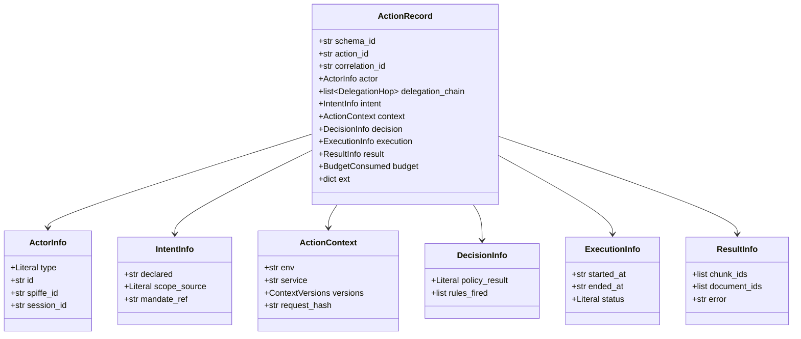
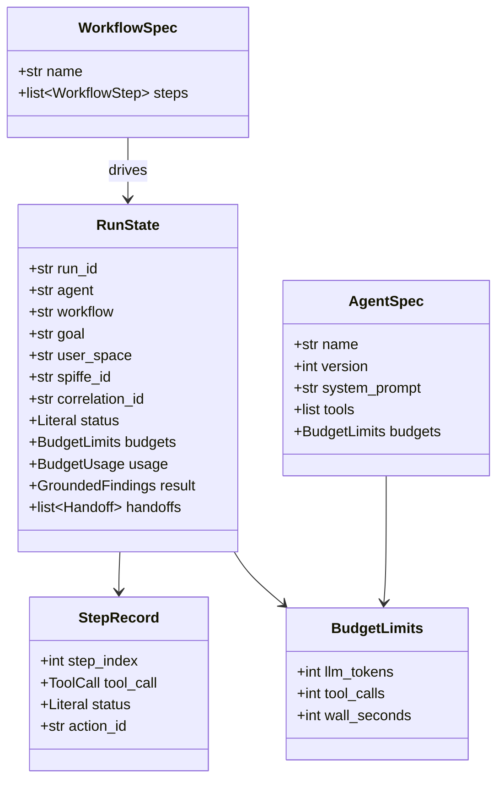
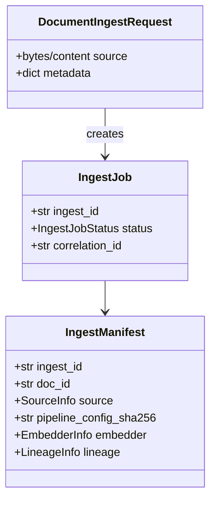
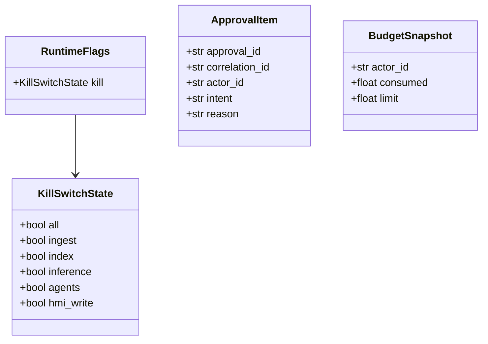
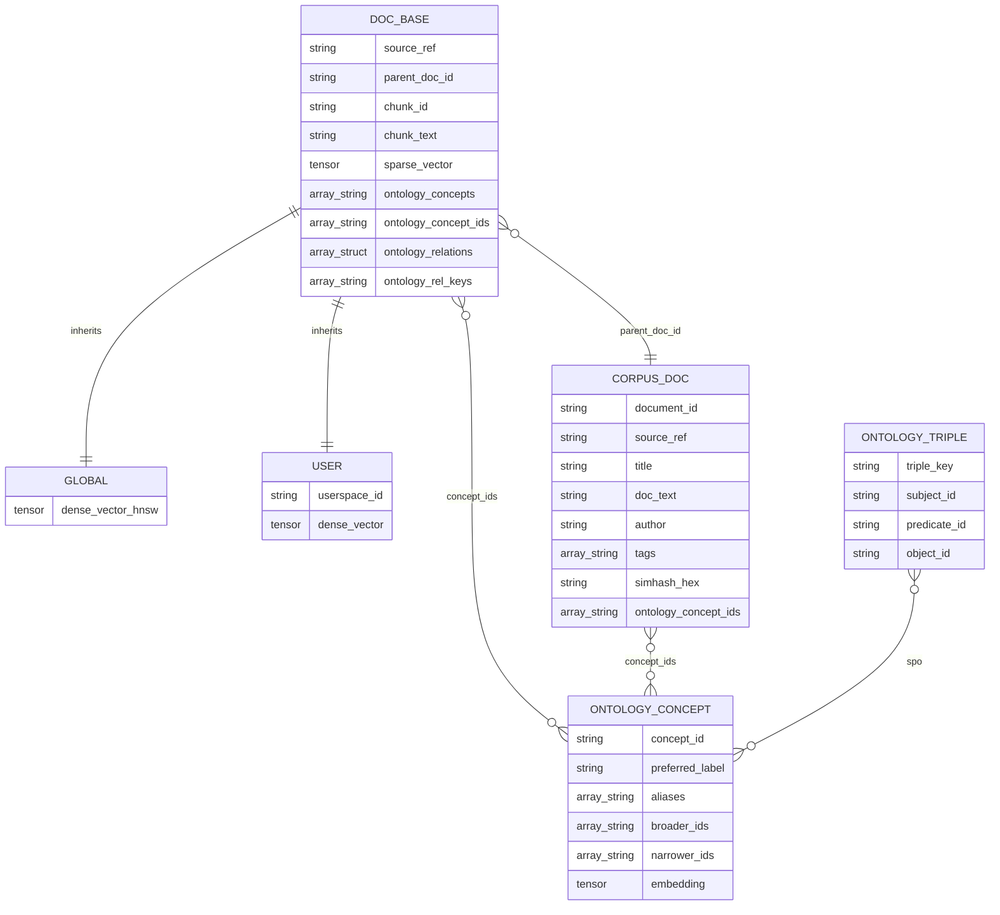

# Data model and schemas

Class diagrams and storage ERDs derived from `tkeir/thot/*/models.py`,
JSON schemas under `tkeir/thot/*/schemas/`, and Vespa schemas in
`vespa/vespa_app/schemas/`.

## Core domain — ActionRecord

Source: `thot/action/models.py`, schema `thot/action/schemas/action.v1.json`.

## Agent / workflow models

Source: `thot/agent/models.py`.

## Ingest models

Source: `thot/tools/ingest/models.py`, schema `thot/tools/ingest/schemas/ingest.manifest.v1.json`.

## Governor models

Source: `thot/governor/models.py`.

## Vespa storage ERD

Schemas: `vespa/vespa_app/schemas/doc_base.sd`, `global.sd`, `user.sd`,
`ontology_concept.sd`, `ontology_triple.sd`, `corpus_doc.sd`.
`user` uses streaming groups (`userspace_id` / `streaming.groupname`);
`global` is index-mode (shared catalog). `corpus_doc` is one row per source
document; chunks store `parent_doc_id` equal to `corpus_doc.document_id`.

`ontology_concepts` is the legacy field name (still written). Values are
**stable concept IDs**, not labels. See [Ontology layer](ontology.md).

`dense_vector` is declared on each child (not in `doc_base`): Vespa forbids
overriding parent fields, and `global` needs HNSW while `user` needs
attribute-only streaming NN.

Passages are indexed by `thot.tools.ingest.index_passages` (BGE-M3 dense + sparse). Retrieval is
`PassageRetrievalPipeline` (`global` / `user` / `both` / `auto`).

Parent documents carry optional `document_ontology.json_ld` produced by
`thot.tasks.document_ontology` as a **Document → Chunk → Sub-ontology**
hypergraph (shared concepts = chunk-set intersection; see
[Document ontology](../tools/document_ontology.md#hypergraph-shape-document--chunk--sub-ontology)).

Checkpoint: field names above match the `.sd` files and Pydantic models in
`thot/*/models.py`.
