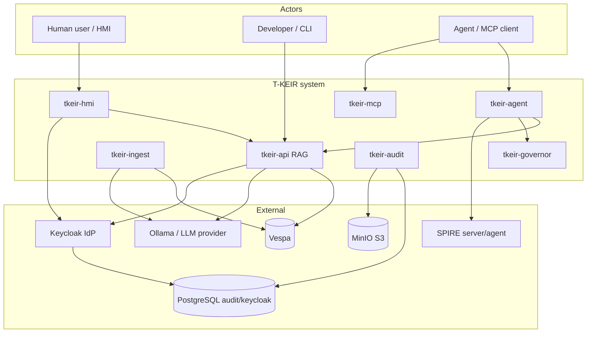
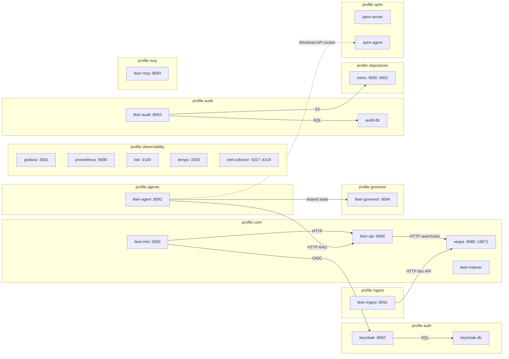
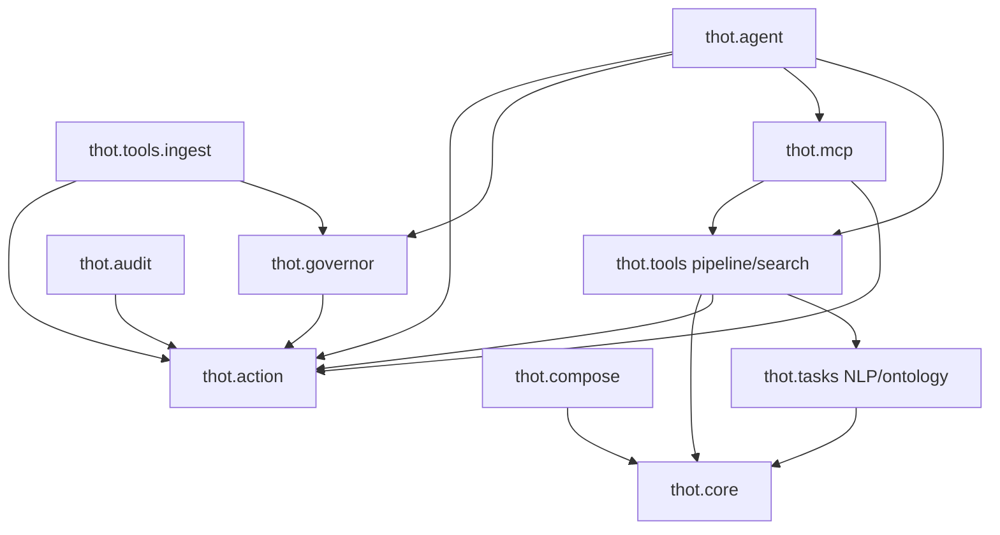

# Architecture overview

T-KEIR is a document-analysis and retrieval platform: NLP pipeline → Vespa
two-level index → hybrid search / RAG → optional agents, ingest, audit, and
governor. Service names and ports below come from
`deploy/compose/docker-compose.yml`. Package layout comes from `tkeir/thot/`.

See also: [Compose](../deployment/compose.md), [Deployment profiles](../deployment/index.md),
[Tools overview](../tools/tools_overview.md).

## System context

Actors and external systems that the Compose / P0 stack talks to. Identity is
Keycloak realm `tkeir` (profile `auth`). LLM / embeddings go through
`UnifiedLLMWrapper` (`PROVIDER`, often Ollama on the host). Search storage is
Vespa. WORM / object data uses MinIO when the `objectstore` profile is enabled.

## Container / service topology

Compose profiles group services (`core`, `auth`, `ingest`, `audit`, `governor`,
`objectstore`, `observability`, `mcp`, `agents`, `spire`). Host ports are the
left-hand side of each `ports:` mapping in
`deploy/compose/docker-compose.yml`.

Note: Compose maps both `tkeir-audit` and `tkeir-mcp` to host port **8093**;
do not enable both profiles on the same host without remapping.

## Module dependency map

Top-level packages under `tkeir/thot/` (from package `__init__.py` layout and
import directions used by the services).

CLIs (`tkeir/pyproject.toml` `[project.scripts]`): `tkeir-pipeline`,
`tkeir-rag`, `tkeir-index-documents`, `tkeir-ingest`, `tkeir-audit`,
`tkeir-governor`, `tkeir-agent`, `tkeir-mcp`, `tkeir-compose`,
`tkeir-init-vespa`, `tkeir-beir-eval`, `tkeir-create-annotation-resource`.

Checkpoint: `make docs-build` from the repo root builds `site/`.
