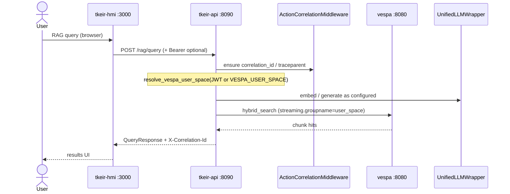
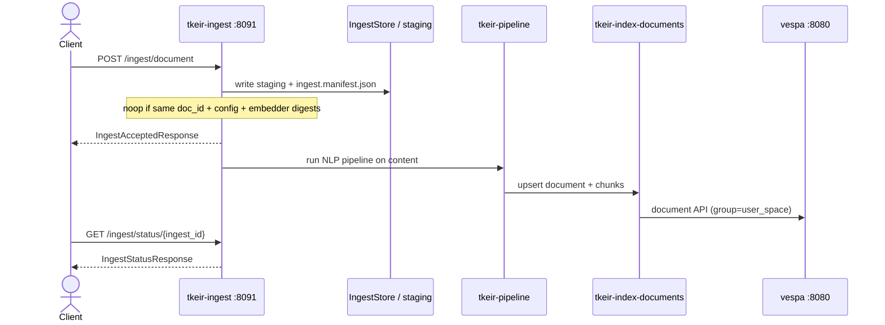
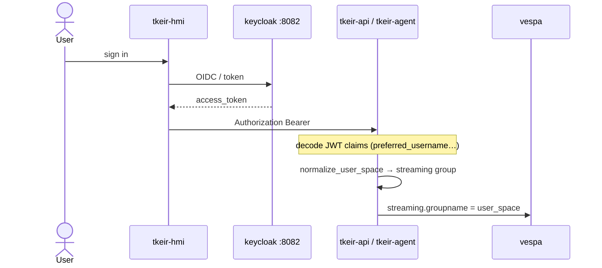
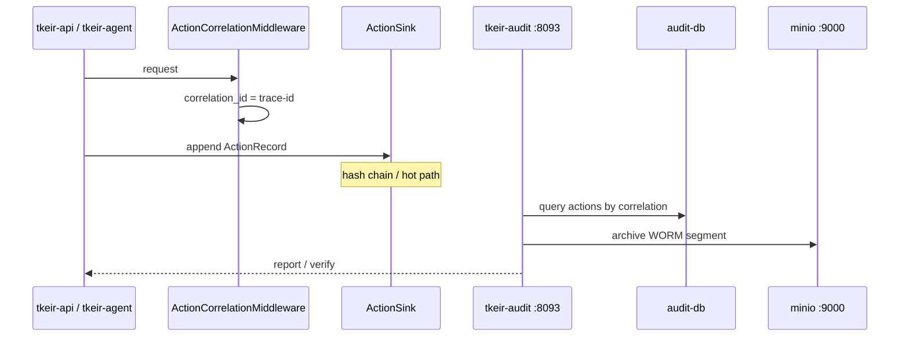

# Data flows and sequences

Sequence diagrams for the main HTTP and background paths discovered under
`tkeir/thot/`. Participants use Compose / CLI service names. Middleware:
`ActionCorrelationMiddleware` (`thot.action.middleware`) and optional
`GovernorEnforceMiddleware` (`thot.governor.middleware`).

## Primary read path — RAG query

Triggered by `POST /rag/query` on `tkeir-api` (`thot.tools.search.app`). The
HMI proxies through Next.js to the API. Search hits Vespa hybrid search;
embeddings / generation use `UnifiedLLMWrapper`. Observable outcome: JSON
`QueryResponse` plus `X-Correlation-Id`.



Checkpoint: with `make rag` and indexed docs, `POST http://localhost:8090/rag/query` returns 200.

## Primary write path — ingest → index

Triggered by `POST /ingest/document` or `POST /ingest/batch` on
`tkeir-ingest` (`thot.ingest.app`), or by CLI `tkeir-pipeline` +
`tkeir-index-documents`. Idempotency uses
`(doc_id, pipeline_config_sha256, embedder.sha256)` (ADR-0002).



Checkpoint: `GET /ingest/health` and status polling after a document POST.

## Authentication / authorisation path

Keycloak issues tokens (realm `tkeir`, host port **8082**). HMI uses Auth.js
OIDC when `AUTH_ENABLED=true`. RAG / agent resolve Vespa `user_space` from
JWT `preferred_username` → `email` → `sub`
(`thot.tools.search.user_space.resolve_vespa_user_space`). Agents also attach
SPIFFE IDs (`thot.agent.spiffe`, ADR-0008).



Checkpoint: password grant with `tkeir-cli` yields `preferred_username` in the access token.

## Agent / workflow execution path

`POST /agent/runs` on `tkeir-agent` (`thot.agent.service`) enqueues
`RunState`, then `AgentLoop` or `Orchestrator`. `AgentGuard` checks kill
switch scope `agents`, budgets, and SPIFFE; emits `ActionRecord`s.

```mermaid
sequenceDiagram
  actor Client
  participant Agent as tkeir-agent :8092
  participant Guard as AgentGuard
  participant Loop as AgentLoop / Orchestrator
  participant API as tkeir-api / MCP tools
  participant Gov as governor_state

  Client->>Agent: POST /agent/runs {goal, agent|workflow}
  Agent->>Agent: resolve user_space + spiffe_id
  Agent-->>Client: run_id queued
  Agent->>Loop: asyncio task
  Loop->>Guard: check_step (kill/budget/SPIFFE)
  Guard->>Gov: flags / approvals
  alt denied
    Guard-->>Loop: deny
  else allow
    Loop->>API: tool invoke (search / rag / …)
    Loop->>Guard: emit ActionRecord
  end
  Client->>Agent: GET /agent/runs/{run_id}
  Agent-->>Client: RunState + steps
```

Checkpoint: `GET /agent/ready` shows `spiffe_id`; run create returns `spiffe_id`.

## Audit / observability path

`ActionCorrelationMiddleware` generates or propagates W3C trace ids.
Services append `ActionRecord` via `default_action_sink`. Audit service
exposes `GET /audit/actions`, `GET /audit/report`, `POST /audit/archive`,
`GET /audit/verify` (`thot.audit.app`). Hot store is PostgreSQL; WORM uses
MinIO object lock when configured (ADR-0003).



Checkpoint: response header `X-Correlation-Id` resolves via audit report when audit profile is up.

## Background / async path

`tkeir-indexer` (Compose `core`) and CLI `tkeir-index-documents` batch-index
pipeline JSON. Agent runs are `asyncio` tasks on the agent process. Audit
`POST /audit/archive` seals WORM segments. No Celery/RQ consumer was found in
`thot/`.

```mermaid
sequenceDiagram
  participant Cron as tkeir-indexer / operator
  participant Index as tkeir-index-documents
  participant Vespa as vespa
  participant Agent as tkeir-agent
  participant Loop as AgentLoop task

  Cron->>Index: scan pipeline output dir
  Index->>Vespa: upsert_document / upsert_chunk
  Note over Agent: POST /agent/runs schedules asyncio task
  Agent->>Loop: background run
  Loop-->>Agent: persist RunState under AGENT_ROOT
```

Checkpoint: indexer logs show upserts; agent run status moves from `queued` → `running`/`succeeded`.
