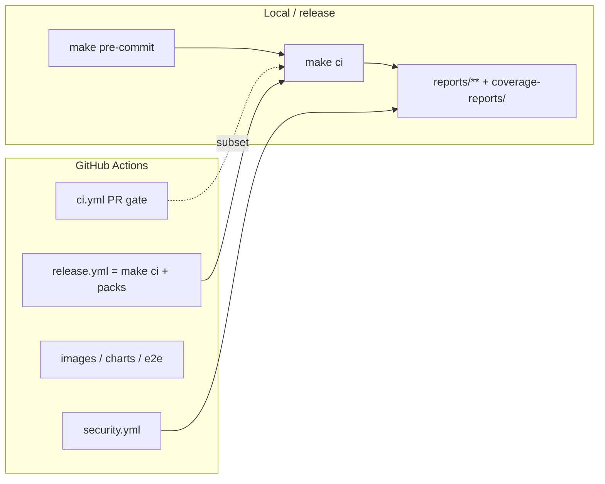

# CI, reports & GitHub Actions

This section is the map of **what runs**, **what it writes**, and **where to read it**.

| Page | What it covers |
|------|----------------|
| **[Overview](index.md)** (this page) | Local `make ci` vs GitHub Actions; where artefacts live |
| **[Workflows](workflows.md)** | All six Actions workflows: triggers, jobs, artefacts |
| **[Reports catalog](reports-catalog.md)** | Every report directory ↔ Make target |
| **[Quality gates](gates.md)** | Thresholds that fail CI (coverage, complexity, SLSA, …) |

Related:

- [Code quality dashboard](../quality/index.md) — generated coverage / complexity / licences
- [CI and evidence (compliance)](../compliance/ci-evidence.md) — how reports feed OPA
- [EU compliance OPA audit](../compliance/eu-audit.md)

---

## Two layers (do not confuse them)



| Layer | Command / workflow | Scope |
|-------|-------------------|--------|
| Fast local | `make pre-commit` | secrets, lint, types, HMI lint/types, **unit tests** |
| Full local | `make ci` | full quality + security + SLSA + compliance + docs |
| PR / `main` Actions | `.github/workflows/ci.yml` | **subset** of `make ci` (no security scans, SLSA, OPA, integration/fuzz/BDD) |
| Scheduled / on-demand | `security.yml`, `e2e.yml` | supply-chain scans; k3d smoke |
| Release tags `v*` | `release.yml` | runs **full** `make ci`, then attaches evidence to the GitHub Release |

**Rule of thumb:** green PR CI does **not** mean you ran the full local gate. Before a release tag, run `make ci` (or rely on `release.yml`).

---

## Report tree (machine artefacts)

Most of these paths are **gitignored**. They appear after you run the matching Make target (or after Actions uploads / Release assets).

```text
coverage-reports/          # coverage.xml (Cobertura)
reports/
  quality/                 # coverage_*, radon_*, licenses.*
  security/                # trivy, pip-audit logs, manifest.json
  bom/                     # CycloneDX SBOM + AIBOM
  dependency-check/        # OWASP DC HTML/JSON
  integration/             # junit.xml
  fuzzing/                 # radamsa / atheris summaries
  bdd/                     # behave.json, junit, optional allure
  slsa/                    # provenance.json, report.json, roadmap.md
  signatures/              # cosign blob bundles
  compliance/
    eu-audit/<version>/    # OPA HTML/JSON + OSCAL
    annex-iv/              # AI Act Annex IV pack
  evidence/<version>/      # release evidence pack
  beir/  generate/         # evaluation runs
site/                      # MkDocs build (make docs-build)
```

Published into MkDocs (tracked / regenerated):

| Dashboard | Regenerated by |
|-----------|----------------|
| [Quality](../quality/index.md) | `make quality-docs` (also during `docs-build`) |
| [Compliance status](../compliance/status.md) | `make audit-compliance` → `compliance-doc-results` |

---

## Quick commands

```bash
make pre-commit          # before push
make ci                  # full local gate
make coverage            # → coverage-reports/ + reports/quality/
make security-report     # → reports/security/ (+ bom, trivy, OWASP)
make slsa-report         # → reports/slsa/ (+ roadmap to next level)
make audit-compliance    # → reports/compliance/eu-audit/ + docs status
make docs-build          # → site/ (includes quality dashboard refresh)
```

See the [reports catalog](reports-catalog.md) for the full target → path table.
