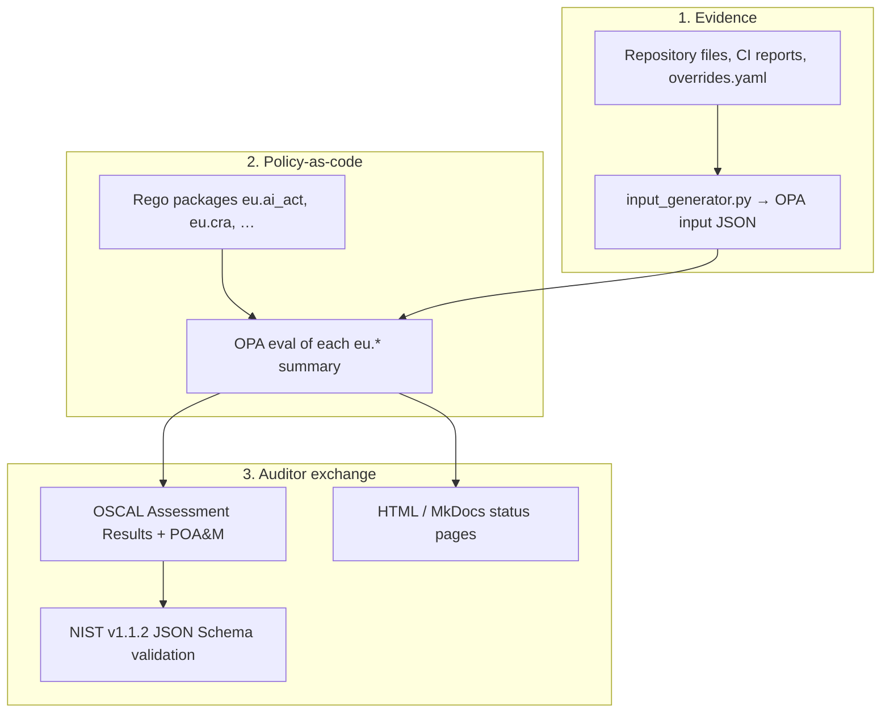

# OPA, Rego, and OSCAL

> **Not legal advice.** This page explains the three technologies behind
> T-KEIR’s machine-checkable EU audit. Operational commands, article tables,
> and category gates live in [EU Compliance OPA Audit](eu-audit.md).

T-KEIR does **not** treat a regulation as a PDF to reread by hand on every
release. It splits the problem into three layers that must stay distinct:

| Layer | Full name | Kind of artefact | Question it answers |
|-------|-----------|------------------|---------------------|
| **OPA** | [Open Policy Agent](https://www.openpolicyagent.org/) | Policy **engine** (binary on `PATH`) | Given this evidence JSON, which rules fire? |
| **Rego** | OPA’s policy language | Policy **source** under `compliance/opa/policies/` | Which EU article is this, when does it apply, what evidence proves it? |
| **OSCAL** | [NIST Open Security Controls Assessment Language](https://pages.nist.gov/OSCAL/) | Policy **exchange documents** (JSON) | How does an auditor / GRC tool import catalogs, SSP, results, and POA&M? |

OPA never “knows” the AI Act. Rego encodes the checks. OSCAL never evaluates
those checks: it is the **envelope** that carries the same conclusions in a
NIST-standard shape other tools already understand.



Two OPA uses exist in this repository. Do not mix them:

| Location | Purpose |
|----------|---------|
| `compliance/opa/` | **Offline EU audit** (`make audit-compliance`) |
| `deploy/policies/app/` | **Runtime** Policy-as-Code for the governor / identity of action |

This page is only about the compliance audit.

---

## OPA (Open Policy Agent)

OPA is a CNCF policy engine. You give it:

1. **Data** — here, one JSON document produced by
   `compliance/opa/collectors/input_generator.py` (repo scan +
   `overrides.yaml`).
2. **Policy** — the Rego files under `compliance/opa/policies/`.
3. **A query** — for example `data.eu.ai_act.summary`.

OPA returns JSON: which articles passed, which violated, which are
`NOT_MANDATORY`. It does not crawl the git tree, talk to Vespa, or call a
lawyer. If a fact is missing from the input document, the policy cannot invent
it.

T-KEIR invokes OPA as a **CLI evaluator**, not as a sidecar:

```text
opa check --v0-compatible compliance/opa/policies/
opa eval  --v0-compatible -d compliance/opa/policies/ -i <input.json> \
          'data.eu.ai_act.summary'
```

(`make audit-compliance` wraps this in `compliance/opa/run_audit.sh` for all
six packages.)

### What OPA is responsible for

- Loading Rego modules into a single policy set (`package eu.ai_act`, …).
- Evaluating rules against `input` (the generated JSON).
- Producing stable, structured result objects consumed by the report and the
  OSCAL bridge.

### What OPA is not

- Not a GRC platform and not a legal opinion.
- Not the NIST document format (that is OSCAL).
- Not the scanner: file presence, SBOM paths, and attestations are decided
  **before** OPA runs. See [CI and evidence pipeline](ci-evidence.md).

Without `opa` on `PATH`, `make audit-compliance` prints a warning and exits
`0` so `make ci` stays green. Set `COMPLIANCE_STRICT=1` if a missing engine
must fail the build.

---

## Rego (the policy language)

[Rego](https://www.openpolicyagent.org/docs/latest/policy-language/) is how
you write what OPA should decide. It is **declarative**: a rule is true when
its body is true. There is no “for each article, if … else …” in the
imperative sense; instead each article is a data row, and helper rules
classify it.

T-KEIR pins **classic / v0** syntax (`opa check --v0-compatible`). Newer OPA
releases default to a different dialect; the flag keeps these policies
evaluable without a rewrite.

### Layout

| Path | Package | Role |
|------|---------|------|
| `compliance/opa/policies/lib/common.rego` | `eu.common` | `violation`, `pass`, `not_mandatory`, `truthy`, `score` |
| `…/ai_act/ai_act.rego` | `eu.ai_act` | AI Act catalogue + gates |
| `…/cra/cra.rego` | `eu.cra` | CRA |
| `…/gdpr/gdpr.rego` | `eu.gdpr` | GDPR |
| `…/nis2/nis2.rego` | `eu.nis2` | NIS2 |
| `…/dora/dora.rego` | `eu.dora` | DORA |
| `…/pld/pld.rego` | `eu.pld` | PLD |

Shared result constructors look like this:

```rego
package eu.common

violation(regulation, article, severity, message, remediation) = v {
  v := {
    "status": "VIOLATION",
    "regulation": regulation,
    "article": article,
    "severity": severity,
    "message": message,
    "remediation": remediation,
  }
}
```

Each regulation package exposes the same rule sets:

| Rule | Meaning |
|------|---------|
| `violations[v]` | Article **applies** and the control is **not** met |
| `passed[p]` | Article **applies** and the control **is** met |
| `not_applicable[n]` | Article **does not apply** (`status: NOT_MANDATORY`) |
| `summary` | Counts, score, article lists |
| `allow` | `count(violations) == 0` |

A typical article is not a page of prose. It is a **catalogue row** in the
same `.rego` file: article id, applicability gate, evidence source
(`evidence` / `attestation` / `either`), and the message shown in reports.
The policy engine then:

1. Evaluates the **gate** (for example “only if AI Act category is
   `HIGH_RISK`”). If the gate fails → `NOT_MANDATORY`.
2. If the gate holds, evaluates the **check** against `input.evidence.*` or
   `input.*.attestation.*`. Explicit `true` is required (`x == true`);
   `false` and `null` both fail a required control.

That tri-state is intentional: `null` means “human has not attested yet”,
not “the control failed in production”.

### Regenerating human tables

Article tables in MkDocs are generated from the same catalogues:

```bash
make compliance-doc-tables
```

Edit Rego first; do not hand-edit `docs/compliance/generated/*_articles.md`.

---

## OSCAL (Open Security Controls Assessment Language)

[OSCAL](https://github.com/usnistgov/OSCAL) is a **NIST** standard for
expressing security catalogs, system implementations, and assessment results
as structured JSON (also XML/YAML in the NIST spec; T-KEIR uses JSON).

OPA answers “does control X pass **on this git describe, today**?” in an
engine-specific JSON shape. An auditor’s GRC tool does not speak
`data.eu.ai_act.summary`. OSCAL is the **lingua franca**: catalogs of
requirements, which components implement them, how they were tested, what
failed, and what remains open.

T-KEIR maps **EU articles** onto OSCAL **controls**. That is an engineering
projection so the same identifier (`ai-act-art-12-1`) appears in the catalog,
the profile, the SSP, and the assessment results. It is not an official EU
OSCAL publication.

### Document types T-KEIR ships

NIST OSCAL is a stack. T-KEIR uses the layers below (`oscal-version` **1.1.2**
everywhere, matching the vendored schemas).

| OSCAL model | T-KEIR path | What it contains |
|-------------|-------------|------------------|
| **Catalog** | `compliance/opa/oscal/catalogs/eu_*_catalog.json` | One `control` per wired article (`ai-act-art-12-1`, `cra-annex-i-parti-1-a`, …) |
| **Profile** | `…/profiles/tkeir_eu_profile.json` | Imports the six catalogs; parameters such as `ai-act-category` |
| **Component definition** | `…/component-definitions/tkeir_components.json` | governor, audit, pipeline, Keycloak, CI, NetworkPolicy → `control-id` + evidence props |
| **SSP** (System Security Plan) | `…/ssp/tkeir_ssp.json` | How this system claims to implement the selected controls |
| **Assessment plan** | `…/assessments/assessment_plan.json` | The automated assessment: `make audit-compliance` as OSCAL tasks |
| **Assessment results** | `reports/compliance/eu-audit/<ver>/oscal/assessment_results.json` | Observations, findings, risks from this OPA run |
| **POA&M** | `…/oscal/poam.json` | Plan of Action & Milestones — one item per open finding |

Catalogs are generated from Rego (`make oscal-catalogs`). Assessment Results
and POA&M are generated from OPA JSON (`opa_to_oscal.py`) after each audit.
The other documents are maintained as the static “what we intend to assess”
layer.

Control id join key (catalog ↔ profile ↔ SSP ↔ results):

```text
Art.12(1)              →  ai-act-art-12-1
AnnexI.PartI.1(a)      →  cra-annex-i-parti-1-a
```

### OPA outcome → OSCAL fields

| OPA status | OSCAL Assessment Results | POA&M |
|------------|--------------------------|-------|
| `PASS` | Observation that the control was satisfied | No item |
| `VIOLATION` | Finding + related risk on the result | One `poam-item` |
| `NOT_MANDATORY` | Observation that the control was not in scope | No item |

UUIDs are **RFC 4122 version 5** (name-based) so a second run with the same
posture diffs as “no change”, not as a new random id. Timestamps use the
OSCAL `date-time-with-timezone` form ending in `Z`.

`opa_to_oscal.py` copies the assessment plan and SSP next to the results so
`import-ap` / `import-ssp` `href`s resolve (`./assessment_plan.json`,
`./tkeir_ssp.json`).

### NIST JSON Schema (production pin)

Canonical schemas are vendored **unmodified** from the NIST
[OSCAL v1.1.2 release](https://github.com/usnistgov/OSCAL/releases/tag/v1.1.2):

`compliance/opa/oscal/schemas/nist-v1.1.2/`

`validate_oscal.py` checks every static document and every generated AR/POA&M
against those Draft-07 schemas (Python `jsonschema`). That runs at the end of
`make audit-compliance` and as `make oscal-validate`.

Do not hand-edit the NIST files. To move to a newer OSCAL, replace the
directory from the matching GitHub release **and** bump `metadata.oscal-version`
in every document together.

---

## Worked example (one article)

Suppose the AI Act catalogue row for **Art.12(1)** (logging) is gated
`high_risk` and checks `input.evidence` for a logging-related key.

1. **Evidence.** `input_generator.py` writes `true` / `false` from the repo
   (or leaves an attestation `null` in `overrides.yaml`).
2. **Rego.** `gate_ok` is false when the determined category is
   `LIMITED_RISK` → `not_mandatory("AI_ACT", "Art.12(1)", …)`. When the
   category is `HIGH_RISK` and the evidence key is not explicitly `true` →
   `violation(...)`.
3. **OPA.** `data.eu.ai_act.summary` lists that article under `passed`,
   `violations`, or `not_applicable`.
4. **OSCAL catalog.** The same article is control `ai-act-art-12-1`.
5. **OSCAL results.** `opa_to_oscal.py` emits an observation (pass / not
   applicable) or a finding + risk (violation), then a POA&M item if open.
6. **Schema.** `validate_oscal.py` rejects the file if a field name, UUID,
   or datetime would not parse as OSCAL 1.1.2.

The HTML report and [Compliance status](status.md) are a third rendering of
**the same OPA summary**, not a second policy engine.

---

## Commands

```bash
make audit-compliance          # evidence → OPA/Rego → OSCAL → NIST schema
make oscal-catalogs            # Rego catalogues → OSCAL catalog JSON
make oscal-validate            # NIST JSON Schema (static + reports/)
make oscal-diff BASELINE=… CURRENT=…   # posture delta between two runs
make compliance-doc-tables     # Rego → MkDocs article tables
```

Install the engine with your OS package manager or from
[OPA releases](https://github.com/open-policy-agent/opa/releases). Confirm
with `opa version`.

---

## Further reading

| Topic | Where |
|-------|--------|
| Run the audit, gates, score, evidence keys | [EU Compliance OPA Audit](eu-audit.md) |
| One-page colored posture | [Compliance status](status.md) |
| CI artefacts that fill `input.evidence` | [CI and evidence pipeline](ci-evidence.md) |
| Tool layout in the repo | [`compliance/opa/README.md`](../../compliance/opa/README.md) |
| OSCAL file map | [`compliance/opa/oscal/README.md`](../../compliance/opa/oscal/README.md) |
| Schema pin and validator notes | [`compliance/opa/oscal/schemas/README.md`](../../compliance/opa/oscal/schemas/README.md) |
| OPA | <https://www.openpolicyagent.org/docs/latest/> |
| Rego | <https://www.openpolicyagent.org/docs/latest/policy-language/> |
| OSCAL (NIST) | <https://github.com/usnistgov/OSCAL> · <https://pages.nist.gov/OSCAL/> |
