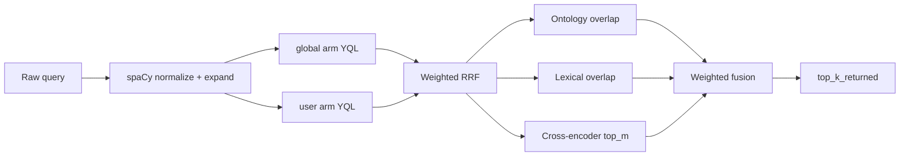

# `rag.yaml` — full configuration reference

Path: `tkeir/configs/rag.yaml`  
Loaded by: `thot.tools.search.rag_config.load_rag_config`  
Dual-hybrid block parsed by: `thot.tools.search.dual_hybrid_config.dual_hybrid_from_mapping`  
Runtime pipeline: `thot.tools.search.passage_retrieval.PassageRetrievalPipeline`

This page describes **every field**, defaults, units, and the algorithms each knob controls.  
Companion prompt file: [`rag-prompts.yaml`](#rag-promptsyaml).

---

## Override order

### Models (`PROVIDER`, embedding, LLM)

1. Environment variables: `PROVIDER`, `EMBEDDING_MODEL`, `LLM_MODEL`, `EMBEDDING_DIM`
   (`RERANKER_MODEL` / `RERANK_STRATEGY` are legacy-only opt-ins)
2. `models:` / `search.rerank.strategy` in this file
3. Hard-coded defaults in `thot.core.LlmWrapper` (no CrossEncoder by default;
   second stage is BGE-M3 ColBERT via `dual_hybrid.colbert`)

### Vespa endpoints / timeout

1. `VESPA_URL`, `VESPA_CONFIG_URL`, `VESPA_TIMEOUT_SECONDS`
2. `vespa:` block below
3. Defaults `http://localhost:8080`, `http://localhost:19071`, `60`

---

## Pipeline overview (passage retrieval)

When `dual_hybrid.enabled: true`, `/search` and BEIR retrieve run
`PassageRetrievalPipeline` against Vespa **`global`** and/or **`user`**
schemas (shared `doc_base` fields).

`search_mode`: `auto` | `global` | `user` | `both`. BEIR smoke/eval force **`global`**.

---

## Top-level blocks

### `vespa`

| Field | Type | Default | Description |
|-------|------|---------|-------------|
| `url` | string | `http://localhost:8080` | Query / document API base |
| `config_url` | string | `http://localhost:19071` | Config server (deploy / init) |
| `timeout_seconds` | number | `60` | HTTP timeout; also used as YQL `timeout` on retrieval arms |
| `user_space` | string | `dev@tkeir` | Streaming group when auth is off / CLI. Live traffic resolves from JWT (`preferred_username` → email → `sub`) |
| `concurrency.enrich_workers` | int | `8` | Parallel parent fetches after legacy search enrich |

Embeddings are always process-wide serialized (local Ollama/vLLM stalls under parallel embed).

### `models`

| Field | Type | Description |
|-------|------|-------------|
| `embedding_model` | string | Source id (e.g. `BAAI/bge-m3`). Runtime FlagEmbedding loads **`tkeir/resources/modeling/net/bge-m3`** (`make pull-bge-model`). Same weights provide dense, sparse, and **ColBERT** multi-vectors |
| `llm_model` | string | Generation model for `/rag/query` (often Ollama) |
| `reranker_model` | string \| null | **Optional / unused by default.** Separate HuggingFace CrossEncoder only if `search.rerank.strategy=cross_encoder` and `RERANKER_MODEL` is set. Production second stage is `dual_hybrid.colbert` (BGE-M3), not `bge-reranker-*` |
| `embedding_dim` | int | Must equal `global.sd` / `user.sd` tensor `x[N]` (default **1024**) |

### `ontology` (HMI / RAG export)

Used when building the fused graph for the HMI Reason tab / prompt SVO mode — **not** the passage-retrieval business ontology.

| Field | Type | Default | Description |
|-------|------|---------|-------------|
| `min_keyword_length` | int | `3` | Drop short keyword labels from export |
| `max_entities` | int | `120` | Cap entities in HMI ontology payload |
| `max_keywords` | int | `60` | Cap keywords in HMI ontology payload |

Keep `min_keyword_length` aligned with `keywords.yaml` → `min-keyword-length`.

### `prompt`

| Field | Type | Default | Description |
|-------|------|---------|-------------|
| `chunk_context_mode` | enum | `svo_ontology` | `chunk_excerpts` = raw chunk text; `svo_ontology` = KEY PASSAGES + deduplicated SVO |
| `max_svo_triples` | int | `80` | Max SVO lines in prompt |
| `passages.count` | int | `5` | Proximity-ranked passage windows |
| `passages.max_chars` | int | `1800` | Max characters per passage |
| `passages.context_sentences` | int | `2` | Neighbor sentences around the best window |
| `max_chars_per_chunk` | int | `1800` | Cap in `chunk_excerpts` mode |
| `max_chunks_for_prompt` | int | `10` | Max chunks kept for generation |

### `answer_generation`

Package: `thot.tasks.answer_generation` (used by `make generate-eval` and offline
retrieve enrichment). CLI flags `--skip-nlp` / `--no-ontology` / `--no-reasoner`
override these defaults.

| Field | Type | Default | Description |
|-------|------|---------|-------------|
| `use_nlp` | bool | `true` | Full NLP on query + evidence (tokenizer → morphosyntax → NER → syntax → keywords) |
| `use_ontology` | bool | `true` | Merge passage `document_ontology` graphs, generate SPARQL clues, inject into QA prompt |
| `use_reasoner` | bool | `true` | Consistency / infer on merged ontology (ignored when `use_ontology` is false) |

### `search` (legacy single-arm path)

Used when `dual_hybrid.enabled: false`. QueryAnalyzer builds one YQL against `user`.

| Field | Type | Default | Description |
|-------|------|---------|-------------|
| `enabled` | bool | `true` | Run QueryAnalyzer NLP on the query |
| `use_chunk_embedding` | bool | `true` | Include `nearestNeighbor(dense_vector, q_dense)` |
| `use_text_raw` | bool | `true` | Include BM25 on `chunk_text` |
| `use_ner` / `use_svo` / `use_keywords` / `use_lemmas` | bool | `true` | Structural YQL features from NLP |
| `ranking_profile` | enum | `auto` | Maps to Vespa `hybrid` |
| `hits` | int | `20` | Vespa hits before optional legacy rerank |
| `max_yql_terms` | int | `48` | Cap OR terms in QueryAnalyzer YQL |
| `weight_chunk_embedding` | float | `0.40` | Informational |
| `weight_text_raw_bm25` | float | `0.60` | Informational |
| `rerank.enabled` | bool | `true` | Legacy second-stage rerank (skipped if `dual_hybrid.enabled`) |
| `rerank.strategy` | enum | `embedding_cosine` | `embedding_cosine` (default) \| `cross_encoder` (opt-in via `RERANKER_MODEL`; **LLM forbidden**). Production uses `dual_hybrid.colbert` |
| `rerank.candidates` | int | `50` | First-stage hits sent to legacy reranker |

---

## `dual_hybrid` — detailed reference

### `enabled` / `search_mode`

| Field | Behaviour |
|-------|-----------|
| `enabled: true` | `/search` → `PassageRetrievalPipeline` |
| `enabled: false` | Legacy QueryAnalyzer single-arm path on `user` |
| `search_mode` | `auto` \| `global` \| `user` \| `both` (BEIR forces `global`) |

### `preprocessing`

Text normalization for the **query** (and for indexing-side ontology / expansion helpers). Order is mandatory: **lemmatize with diacritics → optional ASCII-fold**.

| Field | Type | Default | Description |
|-------|------|---------|-------------|
| `asciifold` | bool | `true` | Strip diacritics after lemmatization (`unicodedata` NFKD) |
| `min_token_length` | int | `3` | Drop shorter lemmas |
| `drop_numbers` | bool | `true` | Drop spaCy `like_num` tokens |
| `extra_stopwords` | list[str] | `[]` | Added to the spaCy model stop list (domain terms only; prefer empty) |
| `spacy_models` | map | — | Per-language model name (string) or `{model: …}`. **`default` (or `xx`) is mandatory** |

Language selection: request `language` / detected document language → matching key → else `default`.

Implementation: `thot.tools.search.text_normalizer.TextNormalizer`.

### `retrieval`

| Field | Type | Default | Description |
|-------|------|---------|-------------|
| `hits` | int | `100` | `hits` + `targetNumHits` for NN clauses |
| `ranking_profile` | string | `hybrid` | Vespa rank-profile on `global` / `user` |

### `index_dump`

When indexing (BEIR eval/smoke, `make index`, ingest), write **one JSON file
per document** under the configured path (gitignored `workspace/` by default).

| Field | Type | Default | Description |
|-------|------|---------|-------------|
| `enabled` | bool | `true` | Write dumps during `index_pipeline_document` |
| `path` | string | `workspace/index-dumps` | Directory (relative to repo root, or absolute). Dataset name is appended as a subdirectory when known |
| `save_document` | bool | `true` | Include full analyzed document + core concepts |

Each file contains `source_ref`, optional `dataset`, and `passages[]` with
`chunk_id`, `chunk` text, `document_ref`, `sparse_vector` (token→weight), and
`ontology_concepts`. Dense vectors are **not** dumped (large).

When `save_document` is true, the dump also includes `analyzed_document` (full
NLP document after external-ontology annotation — `kg` triples carry
`provenance: document|external`, plus `document_ontology` / `core_concepts`)
and a top-level `core_concepts` list (cluster-center concepts always kept on
the document).

### `rank_profiles` → Vespa schemas

These weights are compiled into `global.sd` / `user.sd` by `make schemas`.

#### Passage first-phase score (`hybrid`)

Compiled into `global.sd` / `user.sd` from `rank_profiles.passage.hybrid`:

\[
s = w_d \cdot \mathrm{closeness}(\mathrm{dense\_vector})
  + w_s \cdot \mathrm{sum}(q_{\mathrm{sparse}} \cdot \mathrm{sparse\_vector})
  + w_b \cdot \mathrm{BM25}(\mathrm{chunk\_text})
\]

Default weights (see `rag.yaml`): dense **0.70**, sparse **0.20**, BM25 **0.10**
(Local BGE-M3 dense+sparse is already near published SPLADE on SciFact —
hybrid biases toward dense; T-KEIR must not dilute it with BM25/ontology noise).

**closeness** uses angular distance on `tensor<float>(x[1024])` (BGE-M3).
`global` uses HNSW; `user` (streaming) uses attribute-only exact NN.

**BM25** — Vespa `bm25(chunk_text)` ([Vespa BM25](https://docs.vespa.ai/en/reference/bm25.html)).

There is **no** question-embedding arm and **no** separate document schema.

### `average_field_length`

Passed to Vespa `rank-properties` as `bm25(field).averageFieldLength`.  
Estimate from a corpus with `python scripts/measure_field_lengths.py -i <pipeline-out>` then `make schemas`.

| Path | Typical default |
|------|-----------------|
| `chunk_text` (passage) | 180 |

### `query_expansion`

Expands the query using the **per-request** `business_ontology` (SKOS-like concepts).  
Not loaded from disk in the API.

| Field | Type | Default | Description |
|-------|------|---------|-------------|
| `enabled` | bool | `true` | Resolve concepts + add relation labels |
| `max_terms_per_relation` | int | `5` | Cap synonyms / narrower / broader / related labels per concept |
| `weights.original` | float | `1.0` | Weight of the raw query term |
| `weights.synonyms` | float | `0.9` | Ontology synonyms |
| `weights.narrower` | float | `0.6` | Narrower concepts |
| `weights.broader` | float | `0.3` | Broader concepts |
| `weights.related` | float | `0.2` | Related concepts |
| `nlp_seed_expansion.enabled` | bool | `true` | Feed NLP seeds (NER / keywords / SVO) into resolve + concept neighborhood |
| `nlp_seed_expansion.min_tokens` | int | `32` | Apply when the query has ≥ this many whitespace tokens |
| `nlp_seed_expansion.min_sentences` | int | `2` | Or when the query has ≥ this many sentence spans (`.?!`) |

Additionally, **structural identifier stems** (language-agnostic: e.g. `FoxO3a` → `foxo`) are always added with weight `0.75` (`relation: stem`), capped to 12 stems.  
When `nlp_seed_expansion` is off, or the query is below both thresholds, expansion uses the raw query only (plus stems). Offline BEIR retrieve applies the same gate via `thot.tasks.answer_generation.query_enrichment` (also gated by `answer_generation.use_nlp` / `use_ontology`).  
Implementation: `thot.tools.search.query_expander.QueryExpander` + `lexical_signal.token_stems`.

### `rrf` — Reciprocal Rank Fusion

**Algorithm** (Cormack, Clarke & Buettcher, *Reciprocal Rank Fusion Outperforms Condorcet and Individual Rank Learning Methods*, SIGIR 2009):

\[
\mathrm{RRF}(d) = \sum_{\mathrm{arm}\,a} w_a \cdot \frac{1}{k + \mathrm{rank}_a(d)}
\]

| Field | Type | Default | Description |
|-------|------|---------|-------------|
| `k` | int | `60` | Smoothing constant (classic RRF uses 60) |
| `arm_weights.global` | float | — | Weight of global-arm ranks (when mode includes global) |
| `arm_weights.user` | float | — | Weight of user-arm ranks (when mode includes user) |
| `top_n_after_fusion` | int | `50` | Keep top-N doc ids for ontology / lexical / CE |

Weights should sum ≈ 1 (loader warns if not).

Implementation: `thot.tools.search.fusion.reciprocal_rank_fusion`.

### `ontology_scoring` — OntologyRescorer

Optional second-stage blend of first-stage ranks with **query concept ids**
(from expansion) vs each hit’s indexed `ontology_concepts`.

| Field | Type | Default | Description |
|-------|------|---------|-------------|
| `enabled` | bool | `true` | If false / no query concepts → skip rescoring |
| `rescore_weight` | float | `0.13` | Blend: `(1-w)*first_stage + w*ontology` |
| `match_weights.exact` | float | `1.0` | Same concept id |
| `match_weights.synonym` | float | `0.9` | Ontology synonym link |
| `match_weights.narrower` | float | `0.6` | Traversal via narrower |
| `match_weights.broader` | float | `0.3` | Traversal via broader |
| `match_weights.shared_parent` | float | `0.2` | Shared parent within depth |
| `max_traversal_depth` | int | `1` | Max hops in the business ontology graph |
| `normalize_by_query_concepts` | bool | `true` | Divide total by `#query_concepts` → \([0,1]\) |

Runs **after** Vespa hybrid and **before** ColBERT.  
Implementation: `thot.tools.search.ontology_scorer.OntologyRescorer`.

### `colbert`

BGE-M3 ColBERT MaxSim second stage (production + BEIR).

| Field | Type | Default | Description |
|-------|------|---------|-------------|
| `enabled` | bool | `true` | Skip ColBERT when false |
| `top_m` | int | `40` | Candidates rescored with MaxSim |
| `first_stage_weight` / `colbert_weight` / `tail_weight` | float | `0.55` / `0.45` / `0.15` | Blend with first-stage ranks |
| `batch_size` | int | `8` | Encode batch size |
| `rrf_k` / `pool` | int | `60` / `100` | Offline `retrieve_hybrid` first-stage pool |

### `final_fusion`

| Field | Type | Default | Description |
|-------|------|---------|-------------|
| `top_k_returned` | int | `10` | Hits returned to API after ColBERT / OntologyRescorer |

### `fallback`

| Field | Type | Default | Description |
|-------|------|---------|-------------|
| `neutral_score` | float | `0.5` | OntologyScorer neutral when no concepts |

---

## Stage timings (observability)

`PassageRetrievalPipeline.search` returns `timings_ms` keys (milliseconds).  
`POST /search` exposes them as `SearchResponse.timings` and logs one line per
query including `correlation_id`.

| Key | Meaning |
|-----|---------|
| `nlp` / `expand` | spaCy normalize + ontology expansion |
| `vespa_global` | Global-arm Vespa search |
| `vespa_user` | User-arm Vespa search |
| `ontology_rescore` | OntologyRescorer blend |
| `colbert` | ColBERT MaxSim rerank |

Legacy aliases may appear in older reports (`vespa_chunk` / `vespa_document` ≈ arms).

Smoke / eval reports alert when stage averages exceed budgets (see [Evaluation](../evaluation.md)).

---

## `rag-prompts.yaml`

Prompt templates for `/rag/query` generation (system / user skeletons, citation instructions).  
Loaded alongside `rag.yaml` by the RAG FastAPI app. Edit strings carefully: they affect answer style, not retrieval ranking.

---

## Operational checklist

1. Change passage rank weights → `make schemas` → redeploy Vespa → reindex if fieldset / linguistics change.
2. Change spaCy models → install the named model (`python -m spacy download <model>`).
3. Change `embedding_dim` → regenerate schemas **and** re-embed the corpus (BGE-M3 dim is 1024).
4. Validate with `make beir-smoke` / `make eval-smoke` (production config only; no smoke-local fusion retunes).
5. Rollback to QueryAnalyzer path: `dual_hybrid.enabled: false` (see [migration runbook](../runbooks/dual-hybrid-migration.md)).

---

## Code map

| Concern | Module |
|---------|--------|
| Load YAML | `thot.tools.search.rag_config` |
| Dual-hybrid dataclass | `thot.tools.search.dual_hybrid_config` |
| Pipeline | `thot.tools.search.passage_retrieval` |
| BGE-M3 encode | `thot.tools.search.bge_m3` (weights in `resources/modeling/net/bge-m3`) |
| Indexing | `thot.tools.ingest.index_passages` |
| Generation prompts | `thot.tools.search.generation_prompt` |
| Eval | `thot.tools.eval.beir_eval` / `beir_smoke` / `beir_tkeir` |
| RRF / fusion | `thot.tools.search.fusion` |
| Token stems (expand / ontology index) | `thot.tools.search.lexical_signal` |
| Expansion | `thot.tools.search.query_expander` |
| Ontology overlap | `thot.tools.search.ontology_scorer` |
| Schema gen | `scripts/generate_vespa_schemas.py` |
