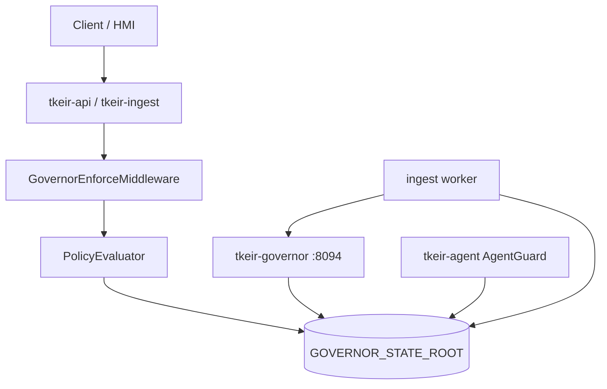

# Governor

Runtime mastering for privileged actions: **modes**, **kill switches**,
**budgets**, **approvals**, and **action tokens**. Design intent:
[Mastering of Action](../regularity-component/action-mastering.md). Operational
emergency steps: [Kill-switch runbook](../runbooks/kill-switch.md).

Engineering documentation only — **not legal advice**.

## Architecture



| Consumer | How it consults governor |
|----------|--------------------------|
| `tkeir-api`, `tkeir-ingest` | ASGI `GovernorEnforceMiddleware` when mode ≠ `off` |
| Ingest workers | `GovernorClient` → `GET /governor/flags`, fallback local `flags.json` |
| `tkeir-agent` | Shared `GOVERNOR_STATE_ROOT` via `AgentGuard` (kill `agents`, budgets, tokens) |
| HMI `/admin` | BFF `/api/governor/*` → governor HTTP API |

## Modes

| `GOVERNOR_MODE` | Behavior |
|-----------------|----------|
| `off` | Middleware not wired; evaluator always allows |
| `observe` (default) | Evaluate + record; **do not** HTTP-block on deny/escalate; budgets still consume on allow |
| `enforce` | Deny/escalate → HTTP **403** + blocked ActionRecord; escalate also enqueues approval |

Invalid values fall back to `observe`. Alias env: `governor.mode`.

**Observe is not mute:** policy still runs and ActionRecords still emit; only
HTTP blocking and approval enqueue-on-escalate are enforce-only.

## Kill scopes

Canonical scopes (`KillScope` / `flags.json`):

| Scope | Typical intents |
|-------|-----------------|
| `all` | Activates every child scope |
| `ingest` | Ingest writes |
| `index` | Index / delete |
| `inference` | Search / RAG inference |
| `hmi-write` | Privileged HMI writes |
| `agents` | Agent run / generate / tool.invoke |

`is_killed(scope)` is true if `all` **or** that scope is active. Intent → scope
mapping lives in governor policy (`INTENT_KILL_SCOPE`); `audit.read` has no kill
scope.

| Surface | `agents` supported? |
|---------|---------------------|
| HTTP `POST /governor/kill` | yes |
| Make `governor-kill SCOPE=agents` | yes (passes through) |
| CLI `tkeir-governor kill --scope` | **no** — choices omit `agents`; use HTTP/Make/HMI |

## Shared state (`GOVERNOR_STATE_ROOT`)

Default Compose path: `/var/tkeir/governor`. Host Make default:
`$(WORKSPACE)/governor`.

| Path | Purpose |
|------|---------|
| `flags.json` | Kill switches |
| `budgets.db` | SQLite budget counters |
| `approvals.json` | Approval queue |
| `revoked.json` | Action-token revocation (next to flags parent, or `GOVERNOR_REVOKE_PATH`) |
| `rollback-requests.jsonl` | Appended by `POST /governor/rollback` |

Mounted by `tkeir-api`, `tkeir-ingest`, `tkeir-governor`, `tkeir-agent`. Compose
`tkeir-volume-init` chowns volumes to **10001:10001**. Unwritable state →
middleware **503** `governor state unavailable`.

## Budgets

- DB: `GOVERNOR_BUDGET_DB` (default `{root}/budgets.db`).
- HTTP policy units: primarily `docs` for write intents (ingest/index/delete).
- Snapshot also exposes `llm_tokens`; agent step gates use agent-YAML budgets
  via `AgentGuard`, not only this store.
- Throttle when `consumed/limit >= GOVERNOR_THROTTLE_RATIO` (default `0.8`).
- Block at `>= 1.0`.
- On allow with status &lt; 400, middleware `consume_for_intent` (+1 doc for write
  intents) in **both** observe and enforce.

Defaults: `GOVERNOR_DEFAULT_DOC_BUDGET=10000`,
`GOVERNOR_DEFAULT_LLM_TOKEN_BUDGET=500000`.

## Approvals

JSON queue at `GOVERNOR_APPROVALS_PATH`. Enqueued on:

- Enforce + escalate (HTTP middleware)
- Agent budget exhaustion (`AgentGuard`)

Statuses: `pending` | `approved` | `denied`. Admin approve/deny via HTTP or HMI
`/admin`.

## Action tokens

- Compact HMAC `body.sig`; secret `GOVERNOR_TOKEN_SECRET` (default is a fixed
  **dev** string — change in any shared environment).
- TTL clamped to **1..300** seconds.
- Mint: `POST /governor/token`; revoke: `POST /governor/revoke` (`jti` and/or
  `actor_id`).
- Agents: `AgentGuard.mint_run_token` for run-scoped authorization.

## Configuration

| Variable | Default | Notes |
|----------|---------|--------|
| `GOVERNOR_MODE` / `governor.mode` | `observe` | `off` \| `observe` \| `enforce` |
| `GOVERNOR_HOST` / `GOVERNOR_PORT` | `0.0.0.0` / `8094` | API listen |
| `GOVERNOR_STATE_ROOT` | `/var/tkeir/governor` | Shared volume |
| `GOVERNOR_FLAGS_PATH` | `{root}/flags.json` | |
| `GOVERNOR_BUDGET_DB` | `{root}/budgets.db` | |
| `GOVERNOR_APPROVALS_PATH` | `{root}/approvals.json` | |
| `GOVERNOR_AUTH_ENABLED` | `false` | Gate admin APIs |
| `GOVERNOR_DEV_TOKEN` | unset | Bearer → admin when auth on |
| `GOVERNOR_DEFAULT_DOC_BUDGET` | `10000` | |
| `GOVERNOR_DEFAULT_LLM_TOKEN_BUDGET` | `500000` | |
| `GOVERNOR_THROTTLE_RATIO` | `0.8` | |
| `GOVERNOR_TOKEN_SECRET` | `dev-governor-token-secret-change-me` | HMAC |
| `GOVERNOR_REVOKE_PATH` | `{root}/revoked.json` | |
| `GOVERNOR_URL` | `http://127.0.0.1:8094` | Clients; Compose `http://tkeir-governor:8094` |
| `GOVERNOR_CORS_ORIGINS` | localhost:3000 variants | |

Admin auth when enabled: Bearer with `intent:admin.override`, Keycloak role
`tkeir-admin`, or `GOVERNOR_DEV_TOKEN`.

## HTTP API

| Method | Path | Auth | Description |
|--------|------|------|-------------|
| `GET` | `/health` | no | Liveness |
| `GET` | `/ready` | no | Includes `mode` |
| `GET` | `/metrics` | no | Prometheus text |
| `GET` | `/governor/flags` | no | Current kill flags |
| `POST` | `/governor/kill` | admin | Body: `scope`, `active`, `reason` |
| `POST` | `/governor/rollback` | admin | Appends `rollback-requests.jsonl` |
| `POST` | `/governor/token` | admin | Mint action token (TTL ≤ 300) |
| `POST` | `/governor/revoke` | admin | Revoke by `jti` / `actor_id` |
| `GET` | `/governor/budgets` | admin | `?actor=`; docs + llm_tokens |
| `GET` | `/governor/approvals` | admin | List queue |
| `POST` | `/governor/approvals/{id}/approve` | admin | |
| `POST` | `/governor/approvals/{id}/deny` | admin | |

Governor API: http://localhost:8094 — HMI `/admin` proxies via `/api/governor/*`.

## CLI

```bash
tkeir-governor flags
tkeir-governor kill --scope ingest --active true --reason drill
tkeir-governor budgets --actor anonymous
```

CLI kill scopes today: `all|ingest|index|inference|hmi-write` (use HTTP for
`agents`).

## Make targets

```bash
make governor-flags
make governor-kill SCOPE=ingest ACTIVE=true REASON=drill
make rollback-index RUN=<run-id> REASON=incident   # curl POST /governor/rollback
```

`GOVERNOR_STATE_ROOT` defaults to `$(WORKSPACE)/governor` for host Make paths
(`make rag` / `make ingest` also ensure the directory exists).

## Compose

```bash
cp deploy/compose/.env.example deploy/compose/.env
make compose-up PROFILES=core,governor
# optional: GOVERNOR_MODE=enforce
```

| Service | Profile | Host port |
|---------|---------|-----------|
| `tkeir-governor` | `governor` | **8094** |
| `tkeir-volume-init` | core / ingest / governor / agents | chown state volumes |

## Helm

Enable in profile values (e.g. secure profile):

```yaml
governor:
  enabled: true
  mode: enforce
```

## Relationship to audit and SPIFFE

- Denied/escalated decisions emit **blocked** ActionRecords into the audit sink
  when configured ([Audit](audit.md)).
- Agent kill scope `agents` and SPIFFE allow-list enforcement couple with
  [SPIRE / SPIFFE](spire.md): when `GOVERNOR_MODE=enforce` and
  `SPIFFE_MODE≠off`, missing/disallowed agent SPIFFE IDs are denied unless
  `SPIFFE_ENFORCE` explicitly disables enforcement.

## Related

- [Mastering of Action](../regularity-component/action-mastering.md)
- [Identity of Action](../regularity-component/action-identiy.md)
- [Kill-switch runbook](../runbooks/kill-switch.md)
- [Audit](audit.md)
- [SPIRE / SPIFFE](spire.md)
- [Compose](compose.md)
- [Secure Kubernetes](k8s-secure.md)
