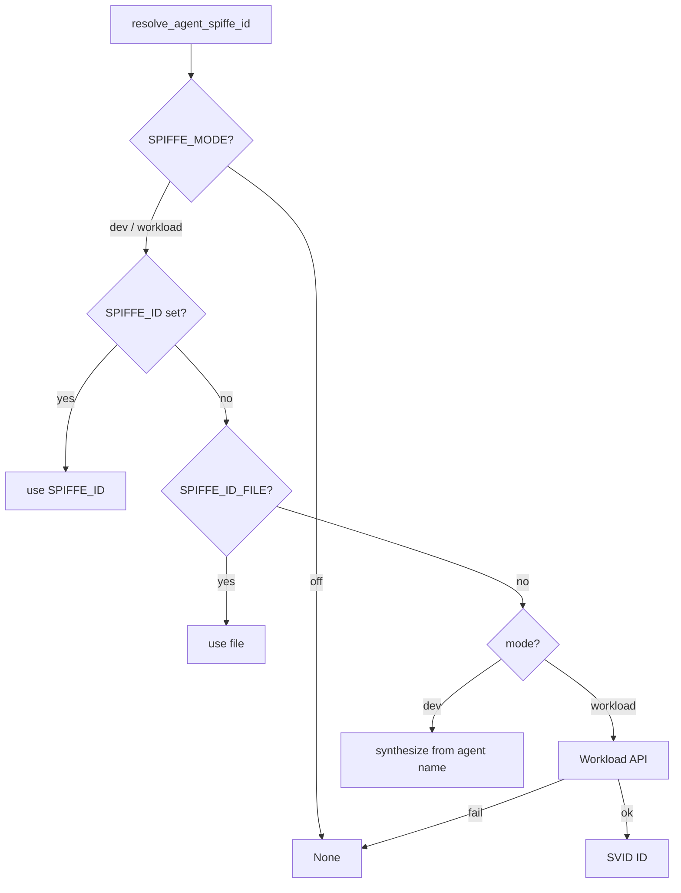
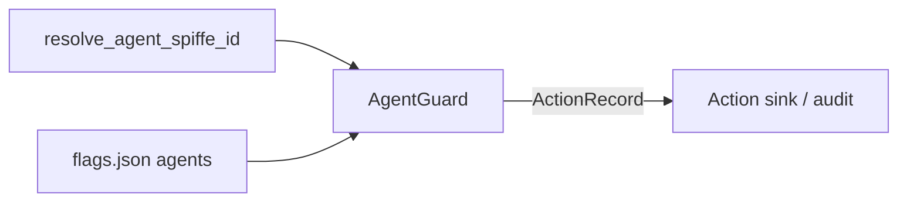

# SPIRE / SPIFFE (agents)

Agent workloads carry a **SPIFFE ID** on every ActionRecord so mastering can
attribute the *machine* actor, not only the human `user_space` tenant
([ADR-0008](../adr/0008-spire-agent-identity.md)). Non-agent services (RAG,
ingest, indexer) remain JWT + correlation based until mesh expansion.

Engineering documentation only — **not legal advice**.

Configs and join/register notes live under `deploy/spire/` (see that
directory’s README in the repository).

## Why agents need SPIFFE

| Without SPIFFE | With SPIFFE |
|----------------|-------------|
| `actor.id` = Keycloak / user space only | Same + `actor.spiffe_id` = workload |
| Multiple agent pods indistinguishable in audit | Distinct `spiffe://…/agent/{name}` |
| Governor `agents` kill works; identity weak | Enforce can deny missing/disallowed IDs |

ActionRecords set `actor.type=agent`, `actor.id=<user_space>`,
`actor.spiffe_id=<SPIFFE ID>` (also mirrored under record extensions where
emitters copy it).

## Identity shape

```text
spiffe://{SPIFFE_TRUST_DOMAIN}/agent/{sanitized_agent_name}
```

- Default trust domain: `tkeir.local`.
- Segment sanitization: non `[a-zA-Z0-9._-]` → `-` (`sanitize_agent_segment`).
- Allow-list prefixes: `SPIFFE_AGENT_ID_PREFIX` (comma-separated), default
  `spiffe://{trust}/agent/`.

Examples: `spiffe://tkeir.local/agent/researcher`,
`spiffe://tkeir.local/agent/tkeir-agent`.

## Modes (`SPIFFE_MODE`)

| Value | Behavior |
|-------|----------|
| `off` | `resolve_agent_spiffe_id` → `None` (P0 without agents) |
| `dev` (default; invalid → `dev`) | After env/file, **synthesize** ID from agent name |
| `workload` | After env/file, Workload API; **no** synthesize on failure → `None` |

## Resolution order

Implemented in `thot.agent.spiffe.resolve_agent_spiffe_id` (code order):

1. Mode `off` → `None`.
2. Explicit `SPIFFE_ID` environment variable.
3. File `SPIFFE_ID_FILE` (default `/var/run/secrets/spiffe/spiffe_id`) if present.
4. If mode is `workload`: Workload API via `SPIFFE_ENDPOINT_SOCKET` and optional
   Python extra `spiffe`; on failure → `None`.
5. Otherwise (`dev`): synthesize `spiffe://{trust}/agent/{name}`.



## Enforcement (`SPIFFE_ENFORCE`)

| Condition | Enforce? |
|-----------|----------|
| `SPIFFE_ENFORCE` in `{1,true,yes,on}` | yes |
| Explicit `{0,false,no,off}` | no |
| Else | yes iff `GOVERNOR_MODE=enforce` **and** `SPIFFE_MODE≠off` |

When enforced, ID must match an allow-listed prefix
(`is_allowed_agent_spiffe_id`). Missing/disallowed → `PermissionError` /
blocked agent run or step + ActionRecord when the guard emits.

Compose defaults `SPIFFE_ENFORCE=false` so local agent stacks stay usable
before SPIRE registration completes.

## Configuration

| Variable | Default / role |
|----------|----------------|
| `SPIFFE_MODE` | `dev` |
| `SPIFFE_TRUST_DOMAIN` | `tkeir.local` |
| `SPIFFE_ID` | Compose agent often `spiffe://tkeir.local/agent/tkeir-agent` |
| `SPIFFE_ID_FILE` | `/var/run/secrets/spiffe/spiffe_id` |
| `SPIFFE_ENDPOINT_SOCKET` | Compose `unix:///run/spire/sockets/agent.sock` |
| `SPIFFE_ENFORCE` | Compose `false` |
| `SPIFFE_AGENT_ID_PREFIX` | `spiffe://tkeir.local/agent/` |
| `SPIRE_JOIN_TOKEN` | Required for SPIRE agent first join |
| `SPIRE_TAG` | Image tag (see `deploy/versions.lock.yaml`; README default `1.15.2`) |

## Local without SPIRE containers

```bash
export SPIFFE_MODE=dev
export SPIFFE_ENFORCE=false   # or true once testing mastering
make agent
# IDs become spiffe://tkeir.local/agent/<agent_yaml_name>
```

## Compose profile `spire`

```bash
# SPIRE server + agent sockets
make compose-up PROFILES=spire

# Agents with workload identity + governor
make compose-up PROFILES=spire,agents,governor,auth
```

| Service | Role |
|---------|------|
| `spire-server` | Trust domain `tkeir.local`; in-container port **8081** |
| `spire-agent` | Workload API socket `/run/spire/sockets/agent.sock`; volume `spire_agent_sockets` |
| `tkeir-agent` | Profiles `agents` (+ optional `spire`); mounts socket **ro**; governor volume |

Configs under `deploy/spire/`:

| Path | Purpose |
|------|---------|
| `server.conf` | SPIRE server |
| `agent.conf` | SPIRE agent → Workload API |
| `register-agent-entries.sh` | Register agent workload entries after join |

Set `SPIRE_JOIN_TOKEN` for the agent’s first join (see Compose comments /
`.env.example`).

There is no dedicated Make `spire*` target; use `make compose-up PROFILES=…`.

## Wiring into ActionRecords and governor

| Component | Behavior |
|-----------|----------|
| `AgentGuard.emit` | `ActorInfo(type=agent, id=user_space, spiffe_id=…)` |
| Run create / `GET /ready` | Expose resolved `spiffe_id` |
| Kill scope `agents` | Shared `GOVERNOR_STATE_ROOT` flags |
| Budgets / tokens / approvals | Same governor state as [Governor](governor.md) |



## Kubernetes

Chart wiring lands with the [secure profile](k8s-secure.md). Until then, mount
a SPIRE Agent Workload API socket (or projected SVID) into the `tkeir-agent`
Deployment and set `SPIFFE_MODE=workload` (+ enforce as needed).

## Operational gotchas

1. **`workload` without socket/file/env** → `None`; with enforce on, runs deny.
2. **File before Workload API** in resolution — a stale `SPIFFE_ID_FILE` wins
   over the live SVID.
3. **Governor observe** does not auto-enforce SPIFFE unless `SPIFFE_ENFORCE=true`.
4. RAG-only P0 paths ignore SPIFFE when agents are not started.

## Related

- [Environment variables](environment.md)
- [ADR-0008](../adr/0008-spire-agent-identity.md) (supersedes ADR-0004 deferral)
- [Agents](../tools/agents.md)
- [Governor](governor.md)
- [Audit](audit.md)
- [Mastering of Action](../regularity-component/action-mastering.md)
- [Identity of Action](../regularity-component/action-identiy.md)
- [Compose](compose.md)
- [Secure Kubernetes](k8s-secure.md)
