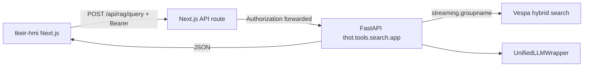

# T-KEIR Human-Machine Interface (tkeir-hmi)

Modern Next.js workspace for the T-KEIR corpus with a **retractable left
accordion** that switches between three modes:

| Mode | Purpose |
|------|---------|
| **Search** | Google-style hybrid retrieval (`POST /search`) — documents & chunks, no LLM report |
| **RAG** | Question → grounded synthesis + downloadable markdown report (`POST /rag/query`) |
| **Agent** | Chat with researcher / workflows (`tkeir-agent`) to explore data and compose custom reports |

Also includes LLM answer synthesis (RAG mode), an interactive fused ontology
navigator, and admin/agent run monitors.

## Prerequisites

- Node.js **20+** and npm
- Running T-KEIR RAG API (`make rag` on port **8090**, from repo root)
- Indexed Vespa corpus (`make bootstrap && make index` into `dev@tkeir`, or
  ingest while signed in to Keycloak)

## Install

```bash
cd tkeir-hmi
npm install
cp .env.local.example .env.local # optional — defaults work for local dev
```

## Development

```bash
npm run dev
```

Open [http://localhost:3000](http://localhost:3000).

The UI proxies API calls through a Next.js **API route** (`app/api/[[...path]]`)
with a long timeout (default **5 minutes**) for RAG + LLM generation. Browser
requests go to `/api/*`; the server forwards to `API_URL` (default
`http://localhost:8090`). When Auth.js has a Keycloak session, proxies attach
`Authorization: Bearer <access_token>` so the RAG/ingest APIs set Vespa
`streaming.groupname` from the JWT (`preferred_username` → `email` → `sub`).
Without auth, the API falls back to **`dev@tkeir`**.

CORS is enabled on the FastAPI server for `localhost:3000` if you set
`NEXT_PUBLIC_API_URL=http://localhost:8090` for direct browser access.

## Production build

```bash
npm run build
npm start
```

Override the upstream API with the `API_URL` environment variable (server-side
proxy target). For slow LLM backends, increase `API_PROXY_TIMEOUT_MS` (default
`300000`).

## Architecture



### Request flow

1. The user submits a natural-language question from the search header
   (language defaults to **fr**, max hits configurable).
2. The client sends `POST /api/rag/query` with `{ query, language, hits }`.
   With Keycloak login, the proxy adds `Authorization: Bearer …`.
3. FastAPI resolves Vespa `user_space` from the JWT (or `dev@tkeir`), embeds
   the query, runs hybrid search scoped to that streaming group, enriches
   chunk hits with parent document metadata, merges RDF graphs into a fused
   ontology, and generates a grounded answer.
4. The dashboard renders synchronized views from the JSON payload:

| UI region | API fields | Behaviour |
|---|---|---|
| Short Answer | `answer` | Concise 1–3 sentence synthesis |
| Detailed Report | `report_markdown`, `highlight_entities`, `highlight_keywords` | HTML markdown view with entity/keyword highlights and `.md` download |
| Main results | `chunks[]` | Grouped by `parent_doc_id`; chunk text highlighted with top ontology labels |
| Ontology sidebar | `ontology.entities`, `ontology.keywords` | Tabs by type; click maps `chunk_ids` → highlight/filter chunks |

### Ontology cross-referencing

Each entity or keyword carries a `chunk_ids` array. Clicking a badge in the
sidebar sets an active filter (`Set<chunk_id>`), dims non-matching chunks,
highlights matches, and scrolls to the first linked chunk via
`data-chunk-id` DOM attributes.

Toggle the same entity/keyword again to clear the filter.

## Environment variables

| Variable | Default | Purpose |
|---|---|---|
| `NEXT_PUBLIC_API_URL` | `/api` | Browser-facing API base (proxied) |
| `API_URL` | `http://localhost:8090` | Server-side proxy target (RAG) |
| `AGENT_URL` | `http://localhost:8092` | Server-side proxy for agent runs (`/api/agent/*`) |
| `GOVERNOR_URL` | `http://localhost:8094` | Governor proxy (`/api/governor/*`) |
| `API_PROXY_TIMEOUT_MS` | `300000` | Upstream timeout for RAG queries (ms) |
| `AUTH_ENABLED` | unset / `false` | When `true`, require Keycloak OIDC login |
| `AUTH_SECRET` | — | Auth.js secret (required if AUTH_ENABLED) |
| `AUTH_KEYCLOAK_ID` | `tkeir-hmi` | Public OIDC client |
| `AUTH_KEYCLOAK_ISSUER` | `http://localhost:8082/realms/tkeir` | Keycloak realm issuer |
| `AUTH_URL` | `http://localhost:3000` | Canonical HMI URL for callbacks |

## Agent run monitor

`/agents` starts workflows against `tkeir-agent`, polls
`GET /agent/runs/{id}`, and offers **Publish** (ApprovalQueue-gated in enforce
mode). See [Agents](tools/agents.md).

## Correlation ID

Every proxied RAG response exposes `X-Correlation-Id`. The dashboard shows it
under the short answer (copy + “Audit this answer” → `/admin?correlation_id=…`).

## Stack

- Next.js 15 (App Router) + TypeScript
- Auth.js (`next-auth` v5) + Keycloak (optional)
- Tailwind CSS + Shadcn/ui (Accordion, Tabs, Cards, Badges, Select)
- Lucide React icons
- React hooks + `fetch` with loading/error states

See also [Vespa RAG backend](tools/vespa_rag.md),
[Agents](tools/agents.md), [MCP server](tools/mcp.md), and
[Compose deployment](deployment/compose.md).
