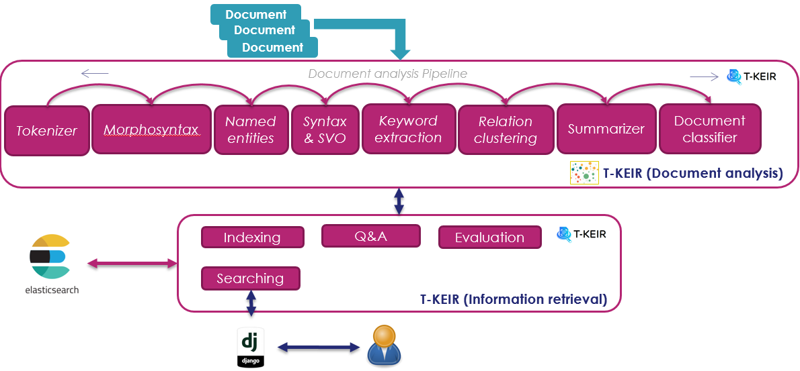
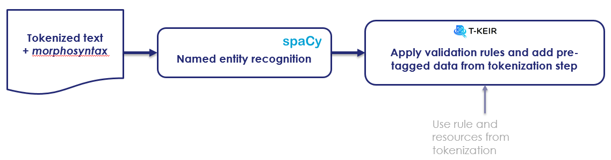

**********
Conception
**********

Data preparation
################
Data preparation consists in

* transform the documents into a format adapted to the tools,
* build terminological and structured resources (such as ontology concepts for example),
* construct the evaluation data. 

.. image:: resources/images/conception2.png

Construction of terminological lists
====================================
Linguistic resources are used by document analysis tools to extract data typed in the target domain
as well as generic data such as city names (to improve the detection of named entities). 

Preparation of the evaluation data
==================================
The evaluation data are constructed to know the relevance of the results returned by the 
search system. We seek to have a set of queries associated with the relevant documents to be returned. 
The goal is ultimately to assess the capacity of the search engine

Document Analysis
#################

.. image:: resources/images/TheresisNLP.png

Tokenization
============

The tokenization phase allows a text to be segmented into linguistic units: sentences, phrases, words.
 
.. image:: resources/images/conception3.png

Principles
Segmentation is a delicate phase that requires the use of regular expressions and strategies to group compound word.

Using regular expressions
-------------------------
Regular expressions allow you to define segmentation rules. These rules cover, among other things:

* The fact that the ‘.’ Is not systematically used as the end of a sentence, in the case of a decimal number in English 
  for example where the period is a separator
* The fact that the ‘-‘ at the beginning at the end of words is separated
* The fact that the ‘-‘ in the middle of a word is not segmented
* ...

Grouping of detached-compound words
-----------------------------------

Detached compound words often represent semantic units, for example the sequence "hot dog" 
should be taken as a phrase and should not be segmented into two words ("hot", "dog"). 
This problem is addressed in T-KEIR tools through the use of phrase list and a Trie 
type tree data structure. 

Resource usage
--------------

Linguistic resources provide a list of phrases that can be typed (for example, the list 
of city names in the geoname database is labeled as a place). They can also define a notion 
of hierarchy in the case of an ontology of concepts. All of these resources are "compiled" 
into a Trie structure. This data structure can be configured to remove diacritics 
(add-ascii-folding option), to add a morphosyntaxic label (pos option) or a named entity 
label (label option) 

+----------------------------------------------------------------------------------------+
| .. image:: resources/images/annotation.png                                             |
+----------------------------------------------------------------------------------------+
| Example of resource configuration file                                                 |
+----------------------------------------------------------------------------------------+

+----------------------------------------------------------------------------------------+
| .. image:: resources/images/example-resource.png                                       |
+----------------------------------------------------------------------------------------+
| Example of resource file                                                               |
+----------------------------------------------------------------------------------------+

Normalization rule
------------------

T-Keir tools provide the ability to normalize words and perform spell checking of the most 
common mistakes. Here simple transformation rules are set up by means of configuration files. 

+----------------------------------------------------------------------------------------+
| .. image:: resources/images/example-typo.png                                           |
+----------------------------------------------------------------------------------------+
| Example of typo configuration file                                                     |
+----------------------------------------------------------------------------------------+

+----------------------------------------------------------------------------------------+
| .. image:: resources/images/example-normalization.png                                  |
+----------------------------------------------------------------------------------------+
| Example of normalization configuration file                                            |
+----------------------------------------------------------------------------------------+

Morphosyntax
============

The morphosyntax module is built on the Spacy library. It provides the possibility of giving 
each segmented term during the tokenization phase a morphosyntactic label (noun, verb, adjective, ...).
This module takes advantage of the pre-tagged information from the segmentation phase by "forcing" 
the tags of phrases and terminology often unrecognized by the original morphosyntactic tagger.
It is also this module which provides the lemmatized form (this is the canonical form of a word, 
for example the verb "doing" has the lemma "do") of words.

.. image:: resources/images/example-ms.png

Named entities extraction
=========================

Named feature extraction involves labeling textual elements. They can be seen as <text, label> pairs
 where the label is the type of data, for example "city", "person", "organization", ...

Principles
----------

The tagger implemented in the use case uses the Spacy library and uses the elements 
extracted during the segmentation phase as well as validation rules built with the 
morphosyntactic elements. 

Use validation rules
--------------------

Validation rules help to avoid basic errors such as associating a city name with a verb. 

.. image:: resources/images/validation-rules.png

Dependencies analysis & triple <Subject, Verb, Object> extraction
=================================================================

.. image:: resources/images/conception4.png

Dependency analysis allows the discovery of relationships between the different structuring 
elements of a sentence.
It therefore provides the possibility of creating <Subject, Verb, Object> triples which will 
form the basis of a knowledge graph automatically constructed by T-KEIR.

Principles
----------

The Dependency Analyzer relies on the Spacy library to extract syntactic dependencies.
This analysis is improved by taking advantage of the groupings carried out during the 
previous phases (segmentation, morphosyntax and extraction of named entities). Thus the 
structured elements detected by Spacy are extended with the data from the previous phases.
Finally, the <Subject, Verb, Object> triples are extracted using syntactic patterns defined 
in a configuration file.

Syntactic rules
---------------

The syntactic rules allow the definition of patterns corresponding to phrases, verbal groups 
or prepositional groups. The creation of these rules is governed by the syntax defined in the 
Spacy library.

Keywords extraction
===================

The keywords are the most relevant words or sequences of words in a document. When they are 
weighted, they allow, for example, the creation of word clouds.
Extracting them is a good way to naively summarize a document by pointing to the most relevant 
elements.

To judge the relevance of the different terms we used the Rake algorithm. It is built on the 
observation that keywords are found between empty words and punctuation marks. The algorithm 
extracts and weights these word sequences using a method described in "Rose, Stuart & Engel, 
Dave & Cramer, Nick & Cowley, Wendy. (2010). Automatic Keyword Extraction from Individual Documents. 
10.1002 / 9780470689646.ch1 (Automatic Keyword Extraction from Individual Documents (researchgate.net))".
T-KEIR uses a modified version of Rake taking into account lemmatized forms and their
morphosyntaxic tags. Thus empty words will be associated with the labels of determinants and 
other conjunctions while the delimiters will be associated with the punctuation tags.

Classifier
==========

.. image:: resources/images/conception8.png

The unsupervised classifer allow to classify text for a given (by the user) set of class / label.

Summarizer
==========

.. image:: resources/images/conception9.png

The summarizer propose an automatic and extractive summmary of document.

Relation clustering
===================

.. image:: resources/images/conception6.png

The relations clustering allows to associate a semantic class with the elements of 
<Subject, Verb, Object> triples (and keywords) in an unsupervised manner (without human intervention).

The construction of the classes is carried out in two stages:

* The elements of the <Subject, Verb, Object> triples and the keywords are vectorized using a 
  transformer neural network (here we use the LaBSE transformer from the Huggingface library) 
  pre-trained on a large amount of data covering a number varied fields. Each of these vectors can 
  be seen as an embedding of sequences of words (associated with a Subject, a Verb, an Object or 
  a keyword) in a semantic space created by the Transformer.
* These four sets of vectors (associated respectively with the Subject, Verb, Object and Keywords) 
  are clustered by a clusterin algorithm. From then on, each vector is assigned a 
  class number and the algorithm creates a model to predict the class of a new vector.

Using a clustering algorithm is a good way to do semantic quantization: we don't store the vectors, 
only their semantic classes predicted by the clustering model. 

Question and Answering
######################

.. image:: resources/images/conception7.png

Indexing
########

Index design
============
The index built by the T-KEIR library is the subject of a particular design responding to the various 
functionalities which are:

* Standard information search (by key words / phrase).
* Structured research by using a knowledge graph with access to Subject, Verb / Predicate / Property, Object type 
  triples. It is essential to note here, that beyond the standard search, the index has been constructed in 
  such a way that the business concepts extracted from the ontology can be used as search criteria. They are 
  therefore considered as <Subject, Predicate, Object> triples of a knowledge graph. 

+-------------------------------------------------------------+
| .. image:: resources/images/index-design-hl.png             |        
+-------------------------------------------------------------+
| The index is built of several facets:                       |
|                                                             |
| * title: document title                                     |
| * content: content of the document                          | 
| * lemma_title: lemmatized version of the title where        | 
|   the tool words and punctuation have been removed          |
| * lemma_content: lemmatized version of the content          |
|   (without tool words)                                      |
| * data_source / index_document: pointer to document         |
| * text_suggester: list of keywords allowing the completion  | 
|   of a query (in the case of a "keywords" type query).      |
| * kg: knowledge graph, a focus is made thereafter.          |
|                                                             |
+-------------------------------------------------------------+

+----------------------------------------------------------------+
| .. image:: resources/images/index-design-ll.png                |
+----------------------------------------------------------------+
| The kg field contains the basic structure for building a       |
| knowledge graph: the <Subject, Predicate / Property, Object>   | 
| triples.                                                       |
| In the T-KEIR index each element of this triplet includes      |
| the following fields:                                          |
|                                                                |
| * class: the class resulting from the cluster of relations     |
|   or keywords when it is available. It is a cluster identifier |
|   linked to the model calculated during the relationship       |
|   clustering phase                                             |
| * content / lemma_content: the textual content of the element  |
| * label: the label associated with the content, in the case of | 
|   a named entity this will for example be "place" or "person"  |
| * positions: the positions of the element when they are        | 
|   available                                                    |
|                                                                |
+----------------------------------------------------------------+

From documentary analysis to index
==================================
The index is fill with results of the linguistic analysis. Each document is analyzed: it follows the diagram 
**Documentary analysis**. The indexing tool uses the content of the result of this analysis to generate indexing 
ElasticSearch queries following the scheme defined in the Design section of the index. 

Searching
#########

The document searching is the step of querying indexes. The rich structure of the index offers many possibilities 
for "querying". Developing a query involves analyzing the user query, constructing an Elasticsearch query and 
manipulating the results

Analysis of the request
=======================
Query analysis follows the same process as document analysis. In this case study, the query corresponds to all or 
part of a document and not simply to a sentence or a juxtaposition of keywords. Using an identical documentary 
analysis ensures that we have the same documentary enrichment as that carried out for the indexed documents. 
The construction of the query to Elasticsearch will therefore be easier.

Building Elasticsearch queries
==============================
Elasticsearch provides a very advanced query language (DSL: Domain Specific Language). This language makes 
it possible to carry out multifaceted interrogation by integrating notions of "boosting" of query elements 
(to give more weight to these elements), advanced combinations of Boolean clauses (OR and AND), notions of  
"slop" to manage the alignments between two sequences ...

Standard queries
----------------
Standard querying simply uses a bag of words constructed from the content of the document (the tokenization phase). 
This bag of words is sorted by how often the words appear in the document.

+----------------------------------------------------------------+
| .. image:: resources/images/basic-query.png                    |
+----------------------------------------------------------------+
| It is possible to configure the request with 2 criteria:       |
| * we use a bag of words sorted by frequency of                 |
|   occurrence without weighting (uniq-word-query)               |
| * Either we “boost” each word according to their frequency.    |
|                                                                |
| In both cases, a maximum number of words must be defined       |
| in the query (cut-query option).                               |
|                                                                |
+----------------------------------------------------------------+

"Advanced" queries allow you to create complex queries based on all fields of the index. 

+--------------------------------------------------------------------------+
| .. image:: resources/images/advanced-query.png                           |
+--------------------------------------------------------------------------+
| The created query can take into account                                  |
| * Fields prefixed by "lemma_" (use-lemma option)                         |
| * Keywords by comparing the keywords from the query with                 |
|   those extracted during the indexing phase                              |
|   (use-keyword options)                                                  |
| * The knowledge graph by building disjunctive queries or the             |
|   sub-queries will be conjunctions of the elements of the                |
|   triples <Subject, Property / Verb / Predicat, Object / Value>          |
|   (use-knowledge-graph option)                                           |
| * The semantics of the keywords with the classes of the                  |
|   clusters: in the same way as the relations, the keywords are           |
|   the object of a clustering and have at this tritre of classes          |
|   which one can interrogate (option use-semantic-keyword )               |
| * The semantics of <Subject, Verb, Object> triples: each element         |
|   of the triplet has semantic classes resulting from clustering          |    
|   (use-semantic-knowledge-graph option)                                  |
| * The concepts of ontology (those extracted by Linguamatics)             |
| * Sentences in documents.                                                |
|                                                                          |
| Then the types of queries defined above can be refined by configuring    |
| them (querying field). Thus it is possible to define the slop            |
| (maximum distance between the words of each sequence), the boosting      |
| value, etc.                                                              |
|                                                                          |
+--------------------------------------------------------------------------+

The use of <Subject, Verb, Subject> triples and sentences leads to the construction 
of potentially very large queries. They are all the greater in that to increase the 
relevance of the results we combine three forms of query: OR, AND and ExactMatch. 

To limit the size of the requests, we apply a clustering algorithm (HDBSCAN) to a TF.IDF 
type vectorization of the sequences (document sentences, elements of triples). The clusters 
thus created, we only use the most relevant sequences (those close to the centers of the clusters). 

Query Expansion
===============
In the study case, a query expansion option by document was implemented. Here we are looking to 
extend the query using other patents.
The strategy implemented is to use the term vectors provided by ElasticsSearch. These vectors contain 
for each document the list of terms of the document. Each term contains statistics related to the index: 
how often the term appears in the document, throughout the index, and the number of documents in which 
the term appears. The idea is to combine all the vectors so as to build a query taking into account all 
the documents: query and document to be extended with their associated statistics. 

Combine & Re-Ranking of results
================================

.. image:: resources/images/scoring.png

Combination strategies
-----------------------
When creating queries we saw that it was possible to take into account several options: use-keyword, 
use-concepts, use-knowledge-graph, use-semantic-keywords, use-semanic-knowledgre graph; these different 
options can be combined within the same query in which case ElasticSearch will sum the values of the similarities
of each option or else be executed in several sub-queries and in this case the merge is done a posteriori.
In this last strategy the lists of results of each subquery are combined by sum of the scores. To ensure that 
there are as many common documents as possible between the search results of the different sub-queries, it is 
possible to extend the number of documents returned by ElasticSearch (expand-results option).
The configuration of the choice between merging within a single query or after the execution of several queries 
is given by the run-clause-separately field.

Scoring of results
------------------

The result scoring is generally presented to the user, unfortunately the score provided by ElasticSearch is not 
bounded and is difficult to interpret as it is. So we have implemented several re-scoring strategies
* By score normalization: the score is normalized by the score of the first ordered document  (the highest score returned by ElasticSearch). The interpretation of the score is simple, corresponding  to the degree of relevance to the most relevant document. But This implies that the most relevant document  will always have a score of 1, even if the actual relevance is low.
* Using metrics on the intersection between the terms of the term vectors of the request and those of the document:  
  * **by-query-size**: we calculate the size of the intersection between a document and the query which we divide  by the size of the query. The score should reflect the presence of all the words of the query in the document.  This is the default configuration.
  * **by-document-size**: we calculate the size of the intersection between a document and the query which we 
    divide by the size of the document. The score should reflect a maximum match between the query and the document.
  * **by-union-size**: we calculate the size of the intersection between a document and the query which we divide 
      by the size of the union between the query and the document (Jaccard similarity). The score must reflect a 
      maximum correspondence between the document and the query and penalize the elements of the query (or document) 
      that do not intersect.
  * **no-normalization**: no normalization. The score will be the one provided by Elasticsearch.

The two types of normalization are multiplied to obtain the final score

