# Conception

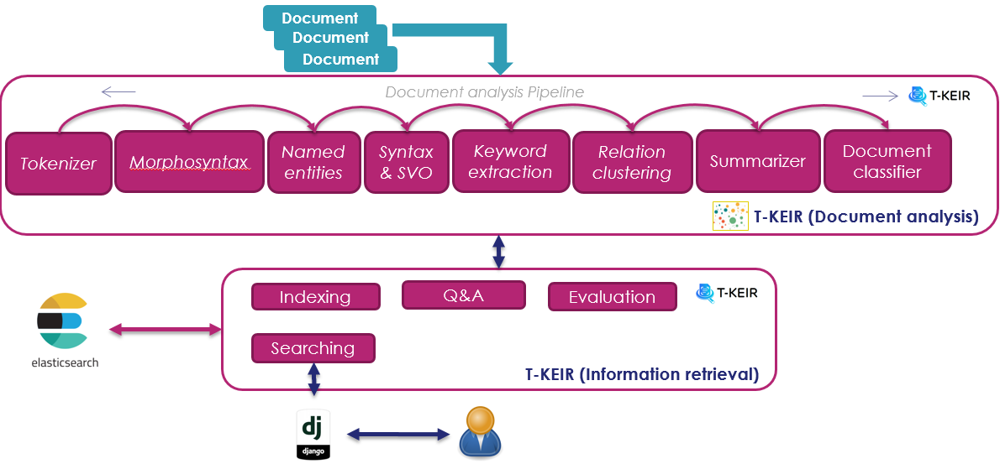

## Data preparation

Data preparation consists in

- transform the documents into a format adapted to the tools,
- build terminological and structured resources (such as ontology concepts for example),
- construct the evaluation data.

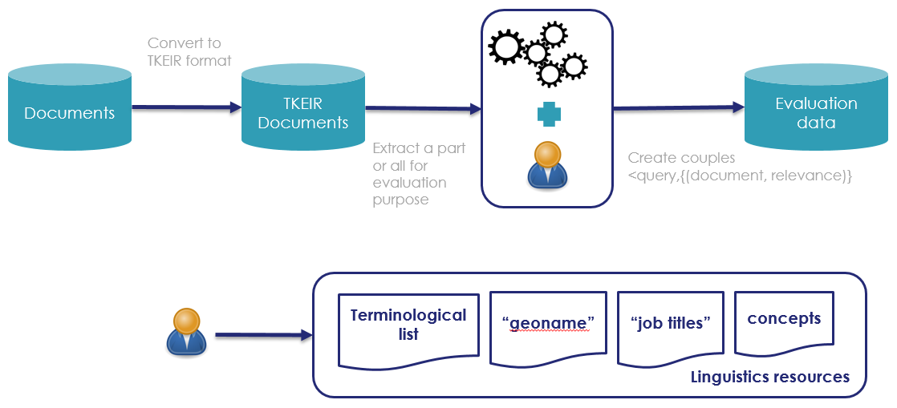

### Construction of terminological lists

Linguistic resources are used by document analysis tools to extract data typed in the target domain
as well as generic data such as city names (to improve the detection of named entities).

### Preparation of the evaluation data

The evaluation data are constructed to know the relevance of the results returned by the
search system. We seek to have a set of queries associated with the relevant documents to be returned.
The goal is ultimately to assess the capacity of the search engine

## Document Analysis

### Tokenization

The tokenization phase allows a text to be segmented into linguistic units: sentences, phrases, words.

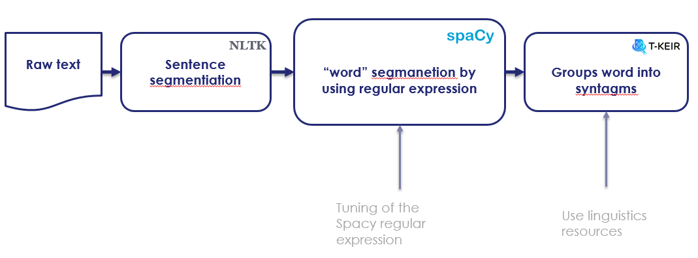

Principles
Segmentation is a delicate phase that requires the use of regular expressions and strategies to group compound word.

#### Using regular expressions

Regular expressions allow you to define segmentation rules. These rules cover, among other things:

* The fact that the ‘.’ Is not systematically used as the end of a sentence, in the case of a decimal number in English
  for example where the period is a separator

* The fact that the ‘-‘ at the beginning at the end of words is separated

* The fact that the ‘-‘ in the middle of a word is not segmented

* ...

#### Grouping of detached-compound words

Detached compound words often represent semantic units, for example the sequence "hot dog"
should be taken as a phrase and should not be segmented into two words ("hot", "dog").
This problem is addressed in T-KEIR tools through the use of phrase list and a Trie
type tree data structure.

#### Resource usage

Linguistic resources provide a list of phrases that can be typed (for example, the list
of city names in the geoname database is labeled as a place). They can also define a notion
of hierarchy in the case of an ontology of concepts. All of these resources are "compiled"
into a Trie structure. This data structure can be configured to remove diacritics
(add-ascii-folding option), to add a morphosyntaxic label (pos option) or a named entity
label (label option)

** Example of resource configuration file **

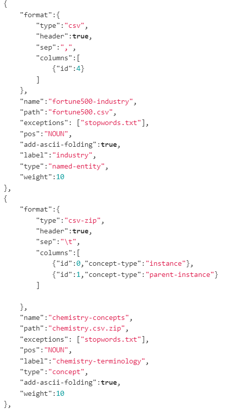

** Example of resource file **

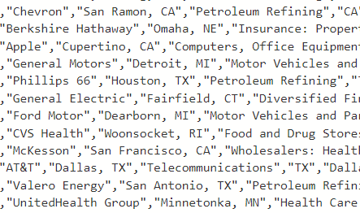

#### Normalization rule

T-Keir tools provide the ability to normalize words and perform spell checking of the most
common mistakes. Here simple transformation rules are set up by means of configuration files.

** Example of typo configuration file  **

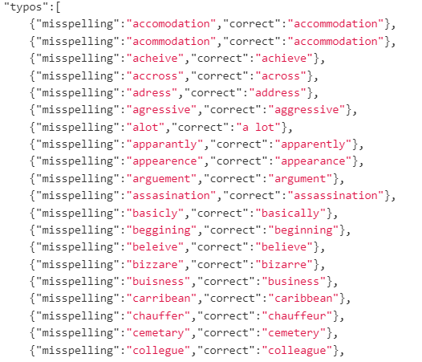

** Example of normalization configuration file **

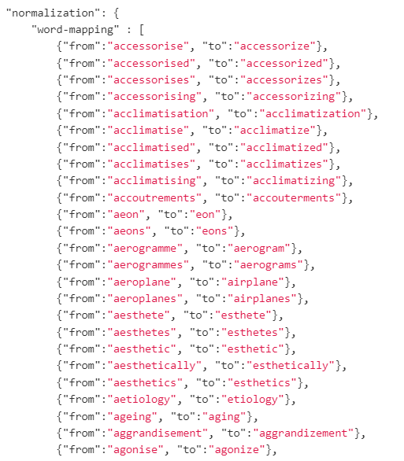

### Morphosyntax

The morphosyntax module is built on the Spacy library. It provides the possibility of giving
each segmented term during the tokenization phase a morphosyntactic label (noun, verb, adjective, ...).
This module takes advantage of the pre-tagged information from the segmentation phase by "forcing"
the tags of phrases and terminology often unrecognized by the original morphosyntactic tagger.
It is also this module which provides the lemmatized form (this is the canonical form of a word,
for example the verb "doing" has the lemma "do") of words.

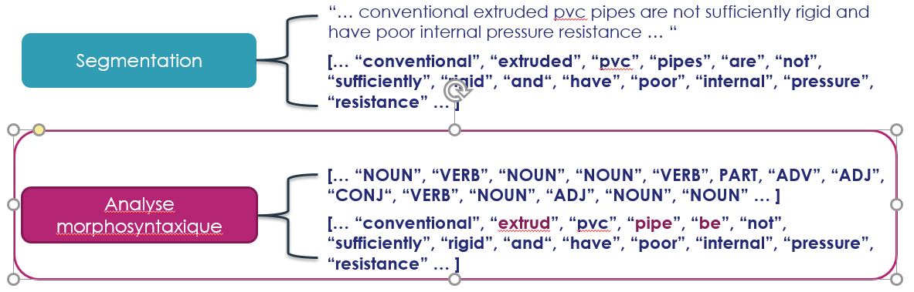

### Named entities extraction

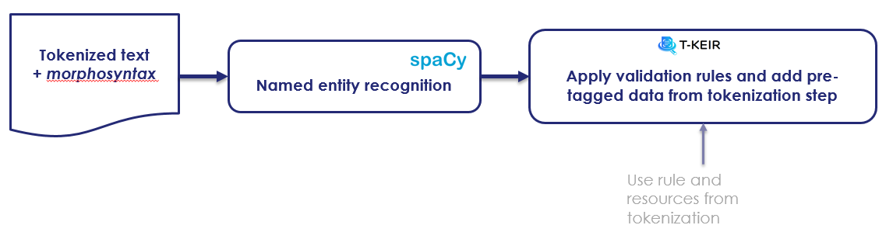

Named feature extraction involves labeling textual elements. They can be seen as (text, label) pairs : where the label is the type of data, for example "city", "person", "organization", ...

#### Principles

The tagger implemented in the use case uses the Spacy library and uses the elements
extracted during the segmentation phase as well as validation rules built with the
morphosyntactic elements.

#### Use validation rules

Validation rules help to avoid basic errors such as associating a city name with a verb.

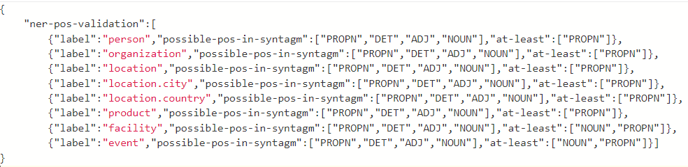

### Dependencies analysis & triple (Subject, Verb, Object) extraction

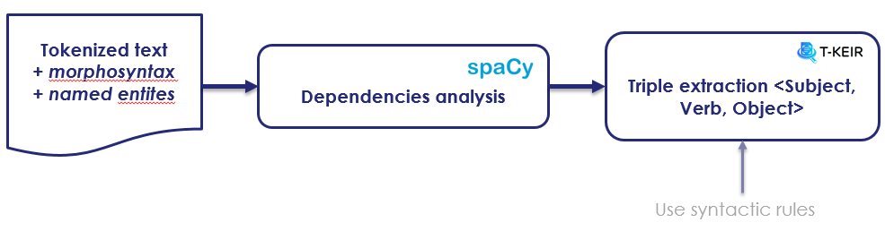

Dependency analysis allows the discovery of relationships between the different structuring
elements of a sentence.
It therefore provides the possibility of creating (Subject, Verb, Object) triples which will
form the basis of a knowledge graph automatically constructed by T-KEIR.

#### Principles

The Dependency Analyzer relies on the Spacy library to extract syntactic dependencies.
This analysis is improved by taking advantage of the groupings carried out during the
previous phases (segmentation, morphosyntax and extraction of named entities). Thus the
structured elements detected by Spacy are extended with the data from the previous phases.
Finally, the (Subject, Verb, Object) triples are extracted using syntactic patterns defined
in a configuration file.

#### Syntactic rules

The syntactic rules allow the definition of patterns corresponding to phrases, verbal groups
or prepositional groups. The creation of these rules is governed by the syntax defined in the
Spacy library.

### Keywords extraction

The keywords are the most relevant words or sequences of words in a document. When they are
weighted, they allow, for example, the creation of word clouds.
Extracting them is a good way to naively summarize a document by pointing to the most relevant
elements.

To judge the relevance of the different terms we used the Rake algorithm. It is built on the
observation that keywords are found between empty words and punctuation marks. The algorithm
extracts and weights these word sequences using a method described in "Rose, Stuart & Engel,
Dave & Cramer, Nick & Cowley, Wendy. (2010). Automatic Keyword Extraction from Individual Documents.
10.1002 / 9780470689646.ch1 (Automatic Keyword Extraction from Individual Documents (researchgate.net))".
T-KEIR uses a modified version of Rake taking into account lemmatized forms and their
morphosyntaxic tags. Thus empty words will be associated with the labels of determinants and
other conjunctions while the delimiters will be associated with the punctuation tags.
