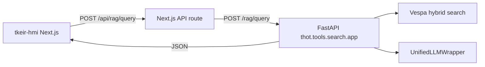

# T-KEIR Human-Machine Interface (tkeir-hmi)

Modern Next.js dashboard for the T-KEIR two-level RAG stack: hybrid Vespa
retrieval at document and chunk levels, LLM answer synthesis, and an
interactive fused ontology navigator.

## Prerequisites

- Node.js **20+** and npm
- Running T-KEIR RAG API (`cd vespa && make rag` on port **8090**)
- Indexed Vespa corpus (`cd vespa && make bootstrap && make index`)

## Install

```bash
cd tkeir-hmi
npm install
cp .env.local.example .env.local   # optional — defaults work for local dev
```

## Development

```bash
npm run dev
```

Open [http://localhost:3000](http://localhost:3000).

The UI proxies API calls through a Next.js **API route** (`app/api/[[...path]]`)
with a long timeout (default **5 minutes**) for RAG + LLM generation. Browser
requests go to `/api/*`; the server forwards to `API_URL` (default
`http://localhost:8090`).

CORS is enabled on the FastAPI server for `localhost:3000` if you set
`NEXT_PUBLIC_API_URL=http://localhost:8090` for direct browser access.

## Production build

```bash
npm run build
npm start
```

Override the upstream API with the `API_URL` environment variable (server-side
proxy target). For slow LLM backends, increase `API_PROXY_TIMEOUT_MS` (default
`300000`).

## Architecture



### Request flow

1. The user submits a natural-language question from the search header
   (language defaults to **fr**, max hits configurable).
2. The client sends `POST /api/rag/query` with `{ query, language, hits }`.
3. FastAPI embeds the query, runs Vespa hybrid search, enriches chunk hits
   with parent document metadata, merges RDF graphs into a fused ontology, and
   generates a grounded answer.
4. The dashboard renders synchronized views from the JSON payload:

| UI region | API fields | Behaviour |
|---|---|---|
| Short Answer | `answer` | Concise 1–3 sentence synthesis |
| Detailed Report | `report_markdown`, `highlight_entities`, `highlight_keywords` | HTML markdown view with entity/keyword highlights and `.md` download |
| Main results | `chunks[]` | Grouped by `parent_doc_id`; chunk text highlighted with top ontology labels |
| Ontology sidebar | `ontology.entities`, `ontology.keywords` | Tabs by type; click maps `chunk_ids` → highlight/filter chunks |

### Ontology cross-referencing

Each entity or keyword carries a `chunk_ids` array. Clicking a badge in the
sidebar sets an active filter (`Set<chunk_id>`), dims non-matching chunks,
highlights matches, and scrolls to the first linked chunk via
`data-chunk-id` DOM attributes.

Toggle the same entity/keyword again to clear the filter.

## Environment variables

| Variable | Default | Purpose |
|---|---|---|
| `NEXT_PUBLIC_API_URL` | `/api` | Browser-facing API base (proxied) |
| `API_URL` | `http://localhost:8090` | Server-side proxy target |
| `API_PROXY_TIMEOUT_MS` | `300000` | Upstream timeout for RAG queries (ms) |

## Stack

- Next.js 15 (App Router) + TypeScript
- Tailwind CSS + Shadcn/ui (Accordion, Tabs, Cards, Badges, Select)
- Lucide React icons
- React hooks + `fetch` with loading/error states

See also [Vespa RAG backend](../tkeir/docs/tools/vespa_rag.md).
