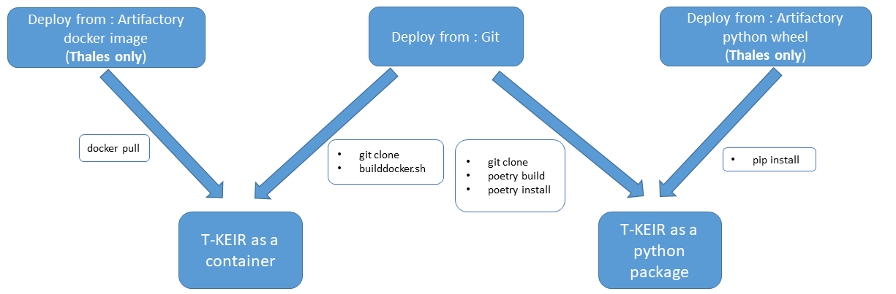

# Installation

These tools work on \*nix, WSL and docker environment.

## Pre-requist : prepare T-KEIR

* install git

```shell  title="Example under ubuntu"
#> sudo apt install git
```

* install poetry. Follow the instructions : [Poetry installation documentation](https://python-poetry.org/docs)

## Directory structure

* **app/bin**           : scripts and tools for server execution
* **app/projects**       : projects templates
* **doc**               : buildable documentation
* **runtimes/docker**   : docker environment
* **resources**         : contain testing resources & automatic index creation data
* **thot**              : tkeir source code


## Installation Prerequists

T-KEIR is a python software, **python 3.8** and **poetry** are necessary for an installation from gitlab/github.
Otherwise and from Thales environnement only, you can install by using pip command. The last way is to use docker




```shell  title="Run the documentation server with mkdocs"
mkdocs serve
```

## Installation

After git repository cloning.
```shell  title="Build a python wheel package:"
#> poetry build
```

A wheel file will be created in "dist" directory. Then you can simply run a pip install on the created wheel.
Note that is highly recommanded to run wheel installation in a python virtual environment.

### Install from Wheel

You can directly install T-Keir from weel:

Go in "dist" folder (created by poetry)

```shell  title="Create a python virtual environement:"
#>  python3 -m venv <YOUR_ENV>`
```

```shell  title="Activate you environement:"
#> source <YOUR_ENV>/bin/activate
```

```shell  title="Install the Wheel:"
#> pip install <FILE_NAME>.whl
```

If there is a problem with **pycurl** install libcurl4-openssl-dev and libssl

```shell  title="E.G under debian/ubuntu:"
#> sudo apt install libcurl4-openssl-dev libssl-dev
```

### Build tkeir docker image

You could build the docker base image. This image contains os and python dependencies and code of search ai with one entry point
by service. The wheel package will be created, so you should ensure poetry is installed and in running path.

Go in **tkeir/runtimes/docker** directory and run the following command:

```shell 
#> ./builddocker.sh
```

### Configure the services

T-Keir provides a script to automatically generate configuration file:
```shell
#> python3 tkeir/thot/tkeir_init_project.py -t <PATH TO TKEIR>/tkeir/app/projects/template/ -o <PATH TO YOUR OUTPUT CONFIG DIR>
```

When you work with a docker you can use a share directory or a volume (to make configurer persistent).

```shell
#> docker run --rm -it -v <PATH TO YOUR SHARE DIRECTORY OR VOLUME NAME>:/home/tkeir_svc/share -w /home/tkeir_svc/tkeir --entrypoint python3 theresis/tkeir /home/tkeir_svc/tkeir/thot/tkeir_init_project.py -t /home/tkeir_svc/tkeir/app/projects/template -o /home/tkeir_svc/share
```

==========================
Initialize/Load the models
==========================

When you build you docker volumes containing model and default configuration are automatically generated.
To update the configuration you can go into directory **app/bin** and run the command:
  
```shell
#> ./init-models.sh <PATH TO CONFIGURATION> <MODEL PATH>
```

Or from docker

```shell
#> docker run --rm -it -v $host_dir:$docker_dir -w /home/tkeir_svc/tkeir --entrypoint bash $tkeir_img /home/tkeir_svc/tkeir/app/bin/init-models.sh $docker_dir/project/configs $docker_dir/project/resources/modeling/net/
```

Where 

* **host_dir** is the variable containing the path to the shared host directory
* **docker_dir** is the variable containing the path to the shared docker directory
* **tkei_img** is the name of the image

Note, that the environment variable TRANSFORMERS_CACHE **HAVE TO BE** always set to model path before run a T-Keir service using models.

Take care of proxies. Please set correclty $HOME/.docker/config.json like that:

```json
  {
    "proxies":
    {
      "default":
      {
        "httpProxy": "your_http_proxy",
        "httpsProxy": "your_https_proxy",
        "noProxy": "your_no_proxy"
      }
    }
  }
```

For a docker compose network environment, don't forget to add **tkeir opendistro** hostname and all services in no_proxy.


### Configure environment variables

You need to configure some path in **".env"** file in directory docker

* ** TRANSFORMERS_CACHE ** : path to models
* ** OPENDISTRO_VERSION ** : version of opendistrop (1.12.0)
* ** OPENDISTRO_HOST ** : opendistro host (0.0.0.0)
* ** OPENDISTRO_DNS_HOST ** : dns host name of opendistro (generally used by client)
* ** OPENDISTRO_PORT ** : opendistro port (9200)
* ** TKEIR_DATA_PATH ** : the hosting path to the data that will be analyzed and indexed
* ** CONVERTER_PORT ** : converter service port
* ** TOKENIZER_PORT ** : tokenizer service port
* ** MSTAGGER_PORT ** : morphosyntactic service port
* ** NERTAGGER_PORT ** : named entities service port
* ** SYNTAXTAGGER_PORT ** : syntax and relation service port
* ** SENT_EMBEDDING_PORT ** : sentence embedding service port
* ** PIPELINE_PORT ** : tagging pipeline service port
* ** KEYWORD_PORT ** : keywords extraction service port
* ** AUTOMATIC_SUMMARY_PORT ** : automatic extractive summary port
* ** SENTIMENT_ANALYSIS_PORT ** : sentiment analysis service port
* ** CLASSIFICATION_PORT ** : unsupervised classification service port
* ** QA_PORT ** : question and answering service port
* ** CLUSTER_INFERENCE_HOST ** : semantic cluster inference port
* ** SEARCH_PORT ** : search service port
* ** TIKA_PORT ** : tika converter port
* ** INDEX_PORT ** : index service port
* ** WEB_PORT ** : web access port
* ** CONVERTER_HOST ** : converter service hostname or ip
* ** TOKENIZER_HOST ** : tokenizer service hostname or ip
* ** MSTAGGER_HOST ** : morpho syntactic tagger service hostname or ip
* ** NERTAGGER_HOST ** : named entities tagger service hostname or ip
* ** SYNTAXTAGGER_HOST ** : syntacic tagger and rule based svo extraction sevice hostname or ip
* ** SENT_EMBEDDING_HOST ** : sentience embedding sevice host name
* ** PIPELINE_HOST ** : tagger pipepline service host name
* ** KEYWORD_HOST ** : keyword extractor service hostname or ip
* ** AUTOMATIC_SUMMARY_HOST ** : automatic extractive service summary hostname or ip
* ** SENTIMENT_ANALYSIS_HOST ** : sentiment analysis service hostname or ip
* ** CLASSIFICATION_HOST ** : usupervised classification service hostname or ip
* ** QA_HOST ** : question and answering service hostname or ip
* ** CLUSTER_INFERENCE_HOST ** : semantic cluster inference host
* ** SEARCH_HOST ** : search service hostname or ip
* ** TIKA_HOST ** : tika converter host
* ** INDEX_HOST ** : indexing service hostname or ip
* ** WEB_HOST ** : web access service hostname or ip
* ** SEARCH_SSL ** : Search is in SSL model
* ** SEARCH_SSL_NO_VERIFY ** : no verify certificate
* ** TKEIR_SSL ** : \[True | False\], enable disable SSL even when SSL is specified in configuration file
* ** ALLOWED_HOSTS ** : django allowed host
* ** ES_MEMORY ** : Elastic search memory
* ** MODEL_PATH ** : path of models (huggingface)


## Copy or create data

T-Keir comes with default configuration file.
Nevertheless you can modify or add file. Most of them are configuration (see configuration section).

### Index mappings

Index mapping is store in **RESOURCES_DIRECTORY/indices/indices_mapping**. if you create new mapping it MUST contains the same fields.
You can freely change the analyzers.

### Resources

The resources are stored in **RESOURCES_DIRECTORY/modeling/tokenizer/\[en|fr...\]**. This directory contains file with list or csv tables.
The descriptions of these file are in **CONFIGS/annotation-resources.json**


