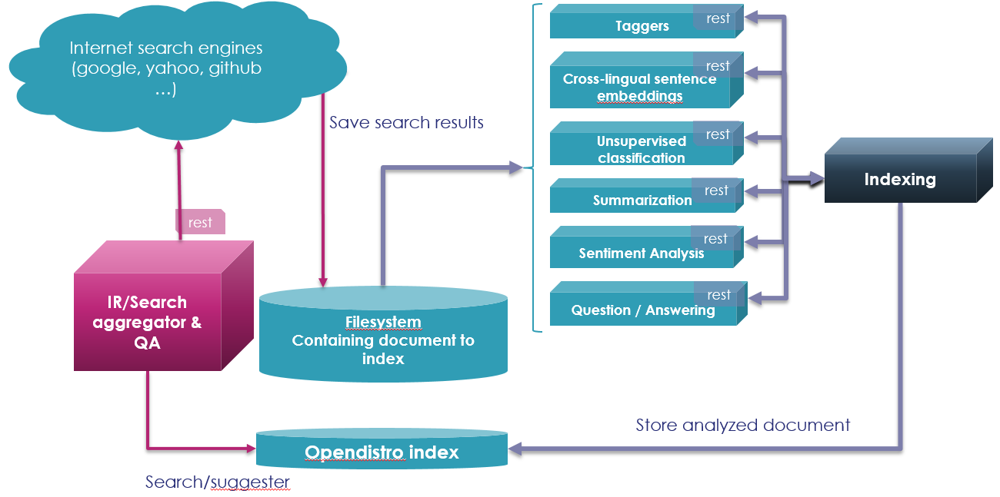
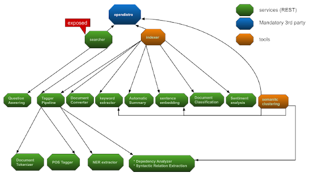

# Overview

TKEIR (Thales Kowledge Extration To Information Retrieval) is a set of REST services allowing to
do knowledge extraction (advanced tokenization, morphosyntax, named entities recognition, dependencies
analysis, keyword extraction, unsupervised classification, sentiment analysis, automatic summary,
question and answering, indexing and information retrieval)

The services architecture is:

TKEIR use intensively Spacy, NLTK and Neural Networks model comming from HuggingFace.
