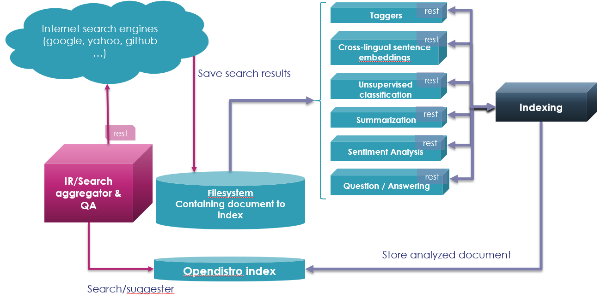
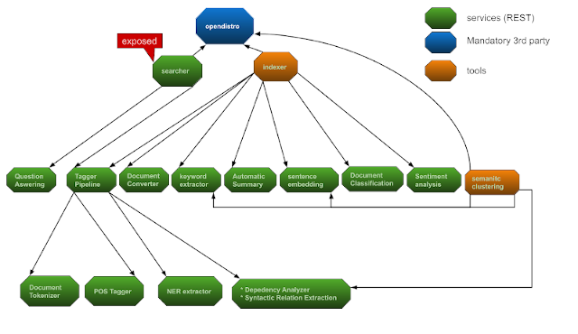

# Overview

TKEIR (Thales Knowledge Extraction To Information Retrieval) is an in-process document analysis pipeline for knowledge extraction (tokenization, morphosyntax, named entity recognition, dependency analysis, and keyword extraction).

The services architecture is:

TKEIR use intensively Spacy, NLTK and Neural Networks model comming from HuggingFace.

## CLI tools (`thot/tools/`)

| Component | Entry point | Module |
|---|---|---|
| Document pipeline | `tkeir-pipeline` | `thot.tools.pipeline` |
| Vespa indexing | `tkeir-index-documents` | `thot.tools.search.index_documents` |
| Vespa RAG API | `tkeir-rag` | `thot.tools.search.app` |
| Vespa bootstrap | `tkeir-init-vespa` | `thot.tools.search.init_vespa` |
| Annotation MWE trie | `tkeir-create-annotation-resource` | `thot.tools.annotation.create_annotation_resource` |

The `vespa/` Makefile invokes search modules as `python -m thot.tools.search.*`.
