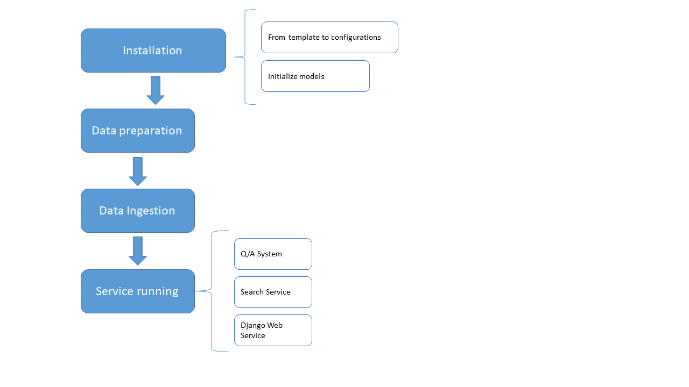

# From Zero to Hero: Create Quickly a ready to run application



This section describes the steps to run the T-KEIR document analysis pipeline.

## Pre-requisite : run the installation part

Go in installation section and run it.

## Prepare T-KEIR and demo

```shell
make setup
make quickstart
```

The quickstart runs the pipeline on bundled fixtures:

- `tkeir/tests/fixtures/test-raw/raw` (raw text)
- `tkeir/tests/fixtures/test-raw/mail` (email)
- `tkeir/tests/fixtures/test-raw/raw-target` (raw text)
- `tkeir/tests/fixtures/converter_test.*` (pdf, docx, rtf; odt skipped — unsupported by MarkItDown)

Results are written under `output/quickstart/`.

### Analyse your documents

Do not forget to setup `TRANSFORMERS_CACHE`: path to models.

Run the unified pipeline on your documents. Use **`-t auto`** for mixed or binary
inputs (PDF, Office); use **`-t raw`** for plain text only.

```shell
tkeir-pipeline -c tkeir/configs/pipeline.json -i <INPUT FILE OR DIR> -o <OUTPUT DIR> -t auto
```

Pipeline steps: converter → language detection → resource selection → tokenizer → morphosyntax → NER → syntax → keywords. Each step adds fields to the output JSON.

JSON inputs that already contain `content` or `content_tokens` skip conversion and start at language detection.
